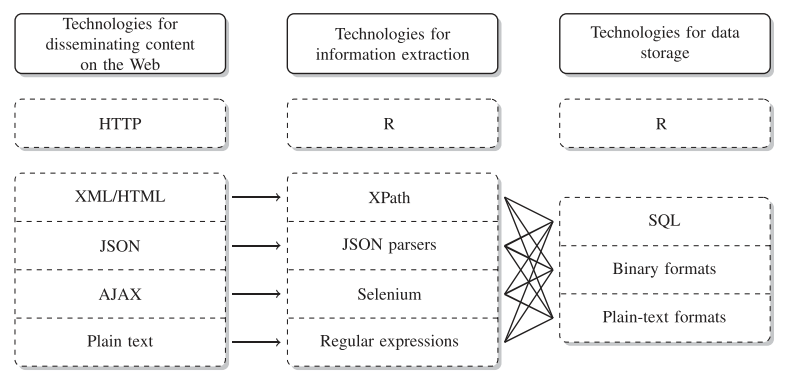

# Scraping Web

La definición del scraping web que se toma en este documento proviene de [@Mitchell2015] que expresa:

**
El Web Scraping es la recolección automática de información de los sitios web. (obviamente no a través de un humano usando un navegador web).
**

Un tema dentro del scraping web son las denominadas APIs (Application Programming Interface), estas son entradas a las paginas web diseñadas por los administradores de la pagina web, por lo mismo no siempre contienen toda la información que se desea. Aunque las API no son tan ubicuas como deberían, puede encontrar API para muchos tipos de información. Interesado en la música? Hay algunas API diferentes que pueden darle canciones, artistas, álbumes e incluso información sobre estilos musicales y artistas relacionados. ¿Necesitas datos deportivos? ESPN proporciona API para información de atletas, puntajes de juegos y más. Google tiene docenas de API en su sección de Desarrolladores para traducciones de idiomas, análisis, geolocalización y más.

## Pasos para la recopilación de información
Siguiendo a [@Iacus2015] que establece cinco pasos al momento de decidir recopilar información mediante el scraping web, estos pasos son:

1.  Asegúrese de saber exactamente qué tipo de información necesita. Esto puede ser específico (``el producto interno bruto de todos los países de la OCDE durante los últimos 10 años'') o vago (``opinión de la gente sobre el teléfono de la empresa X'', ``colaboración entre miembros del Senado de los Estados Unidos'').
2. Averigüe si hay fuentes de datos en la Web que puedan proporcionar información directa o indirecta sobre su problema. Si está buscando hechos concretos, esto probablemente sea fácil. Si está interesado en conceptos bastante vagos, esto es más difícil.

**La página de inicio de la embajada de un país podría ser una fuente valiosa para la acción de política exterior que a menudo se oculta detrás del telón de la diplomacia. Los tweets pueden contener tendencias de opinión sobre casi todo, las plataformas comerciales pueden informar sobre la satisfacción de los clientes con los productos, las tarifas de alquiler en los sitios web de propiedades pueden contener información sobre el atractivo actual de los barrios de la ciudad ...
**

3. Desarrolle una teoría del proceso de generación de datos cuando busque fuentes potenciales. ¿Cuándo se generaron los datos, cuándo se cargaron en la Web y quién lo hizo? ¿Existen áreas potenciales que no están cubiertas, son consistentes o precisas, y puede identificarlas y corregirlas?
4. Equilibrar las ventajas y desventajas de las posibles fuentes de datos. Los aspectos relevantes pueden ser la disponibilidad (¡y la legalidad!), los costos de recolección, la compatibilidad de nuevas fuentes con la investigación existente, pero también factores muy subjetivos como la aceptación de la fuente de datos por parte de otros. También piense en posibles formas de validar la calidad de sus datos. ¿Existen otras fuentes independientes que brinden información similar para que sean posibles verificaciones cruzadas aleatorias? En caso de datos secundarios, ¿puede identificar la fuente original y verificar los errores de transferencia?
5. ¡Toma una decisión! Elija la fuente de datos que le parezca más adecuada, documente los motivos de la decisión y comience con los preparativos para la recopilación. Si es factible, recopile datos de varias fuentes para validar las fuentes de datos. Muchos problemas y beneficios de varias estrategias de recopilación de datos salen a la luz solo después de la recopilación real.

## Tecnologías de diseminación, extracción y almacenamiento Web
Una vez elegida la fuente de datos (página web) y al menos con la intuición de lo que se quiere obtener, el siguiente paso es decidir el mecanismos para el scraping (raspado), esto esta relacionado al tipo de pagina web, ver si esta ofrece una entrada API y conocer sus limitaciones puede ser un punto de partida. Esto se denomina *Technologies for disseminating, extracting, and storing web data Collecting*, en el marco del uso de R la figura \ref{scrap1} muestra las interacciones entre ellas.


*Tecnologías para difundir, extraer y almacenar datos web (considerando el entorno de R)*

## Librerías en R
El siguiente cuadro presenta las librerías en R relacionadas al web Scraping, incluyendo los servicios API, que a la fecha del proyecto alcanza a 761 librerías, esto representa el $5.02$% de las librerías en en R.

```{r,eval=F,message=FALSE}
library(knitr)
library(packagefinder)
library(xtable)
findPackage(c("API","scrape"),limit.results=-1)
```

## Librería rvest

Rvest es parte del universo tidyverse y esta orientada al scrape de páginas web. La instalación es usual:

```{r,eval=F}
#desde CRAN
install.packages("rvest")
#la versión en desarrollo desde github
devtools::install_github("tidyverse/rvest")
```

Existe la herramienta selectorgadget disponible en http://selectorgadget.com/, esta permite interactuar con las paginas web para seleccionar partes del documento usando un CSS selector. Las funciones mas importantes dentro de rvest son:

* read_html para cargar la estructura de la página
* html_nodes para extraer informacion de la pagina segun el CSS selector
* html_text para extraer texto de un html_nodes
* html_table para extraer tablas y ponerlas en data frame

## Ejemplo: Ketal

Una de las potencialidades del scraping es poder rescatar información contenida en páginas web, según la estructura de esta, en esta sección se presenta un ejemplo del código y la recolección de información que puede realizarse. Para esto se eligió la página de supermercados Ketal que es abierta y publica los precios de sus distintos productos de forma categorizada por tipo de productos. 

El estudio de esta pagina tiene el principal objetivo de mostrar el proceso de extracción, el uso potencial de la información esta relacionada a tener la variación de los precios y para futuros estudios se podría completar el ejercicio incluyendo la parte de la demanda mediante la encuesta de presupuestos familiares y poder así pronosticar la inflación dentro de este sector y para la población potencial que acude a supermercados.

El ejemplo presenta el proceso del scraping para 8 grupo de productos:

* Carne de aves
* Carne de cerdo
* Carne de res
* Pescado
* Leches
* Aceites
* Frutas y verduras
* Dulces


Se emplea la libreria *rvest*, que es un paquete diseña para para facilitar la descarga y la manipulación de HTML y XML. También se utiliza la extensión Selector Gadget https://selectorgadget.com, este permite la identificación de las estructuras de las páginas web.

El objetivo del raspado es obtener el nombre del producto, su código, y el precio. Utilizando el selector gadget se identifica que en $.product-name$ se guardan los nombres, en $.price.product-price$ el precio del producto y en $data-id-product$ el identificador del producto. En R el código es:

```{r,eval=FALSE}
#librerías para el raspado
library(rvest)
#Enlaces de los grupos de productos
ave <- read_html("https://www.ketal.com.bo/209-aves")
cerdo<-read_html("https://www.ketal.com.bo/208-cerdo")
res<-read_html("https://www.ketal.com.bo/210-res")
fish<-read_html("https://www.ketal.com.bo/17060162-pescados")
leches<-read_html("https://www.ketal.com.bo/53-leches-liquidas")
aceites<-read_html("https://www.ketal.com.bo/272-aceites-y-vinagres")
frutaver<-read_html(
  "https://www.ketal.com.bo/50-frutas-y-verduras?id_category=50&n=150")
dulce<-read_html(
  "https://www.ketal.com.bo/15-chocolates-y-golosinas?id_category=15&n=150")
#definición de la base de datos que guarda la información
bd<-NULL
#Algoritmo del raspado de los 8 productos
k<-1
for(i in list(ave,cerdo,res,fish,leches,aceites,frutaver,dulce)){
  print(k)
  name<-html_attr(html_nodes(i,".product-name"),"title")[-1]
  precio<-html_text(
    html_nodes(i,".price.product-price"),trim=T)[seq(1,length(name)*2,2)]
  code<-html_attr(html_nodes(i,".add_to_compare"),"data-id-product")
  bd<-rbind(bd,data.frame(name,precio,code))
  k<-k+1
}
#se identifica el día
day<-substr(Sys.time(),1,10)
#se guarda la informacion en base al dia del raspado
bd$day<-day
save(bd,file = paste0(day,".RData"))
```

## Ejemplo: Ministerio de Educación

```{r, eval=FALSE}
library(rvest)
library(foreign)
library(xlsx)
########################
bd<-read.dta("mmUE.dta")
rue<-bd$cod_ue_det
rue<-unlist(strsplit(rue,";"))
bd<-data.frame(matrix(0,1,78))
k<-1
for(i in 325:length(rue)){
 print(i)
urlmin<-paste0("http://seie.minedu.gob.bo/reportes/mapas_unidades_educativas/ficha/ver/",rue[i])
 ue <- read_html(urlmin,encoding = "UTF-8")

jj<-grepl("Error was",unlist(strsplit(html_text(html_nodes(ue,"strong"))[1:2],":"))[c(2)])
if(jj==T){
  next()
}
#nombre id (2)
bd[k,1:2]<-unlist(strsplit(html_text(html_nodes(ue,"strong"))[1:2],":"))[c(2,4)]
#Informacion administrativa (12)
bd[k,3:14]<-html_text(html_nodes(ue,"dd"))
#matricula #promovidos #reprobacion #abandono # (60)
#matricula
for(j in 1:4){
bd[k,(15*j):(14+15*j)]<-as.integer(unlist(html_table(ue)[j])[-c(1:3)])
}
#servicios (4)
bd[k,75:78]<-html_text(html_nodes(ue,"strong"))[18:21]
k<-k+1
}
write.xlsx(bd,"ue2017.xlsx",row.names = F)
```

## Ejemplo, informacion COVID-19 en Bolivia

```{r,eval=F}
library(rvest)
#paso 0: Estadísticas del covid-19 en Bolivia
#paso 1: cargar la www de interés
bs<-read_html("https://www.boliviasegura.gob.bo/")
ww<-read_html("https://www.worldometers.info/coronavirus/")
#paso 2: Raspar la información de interés
node0<-html_nodes(bs,"h1")
node1<-html_text(node0)
node2<-as.numeric(node1) 
barplot(node2,legend.text = c("Confirmados","Recuperados","Muertes"))

aux<-html_nodes(bs,".mapanuevos")
#paso 3: trabajando con tablas
tabla<-html_table(bs,fill = T)
tabla[[2]]
#paso 4: limpieza
#paso 5: Análisis
```

## APIs

Conocida también por la sigla API,"application programming interface", es un conjunto de subrutinas, funciones y procedimientos (o métodos, en la programación orientada a objetos) que ofrece cierta biblioteca para ser utilizado por otro software. Ofrece una entrada a los datos que distribuye el API.

### API Banco Mundial
La API ofrece acceso a las estadísticas que genera el Banco Mundial, existe un set extenso de estadisticas de la mayoria de los paises. La API ofrece mas de 16000 indicadores de series de tiempo, muchos de los indicadores tienen una cobertura de 50 años. La API incluye el acceso a 45 bases de datos, incluyendo:

* World Development Indicators
* International Debt Statistcs
* Doing Business
* Human Capital Index
* Subnational Poverty
* Y otros, [ver](https://datahelpdesk.worldbank.org/knowledgebase/articles/889392-about-the-indicators-api-documentation)

En R s epuede acceder mediante la libreria wbstats.

```{r,eval=F}
install.packages("wbstats")
library(wbstats)
#acceso a todos los indicadores disponibles
wbindicators("es")
#acceso al catalogo de datos
wbdatacatalog()
#búsqueda de indicador
wbsearch(pattern = "education")
# ver los países y sus códigos 
wbcountries()             
#Comando para extraer los indicadores
wb(country = "BOL",indicator = "NY.GDP.MKTP.CD", startdate = 2000, enddate = 2016)
```


### API Google trends

La librari gtrendsR permite acceder a la API de [google trends](https://trends.google.es/trends/?geo=ES), esta permite acceder a las tendencias de busqueda que se realizan mediante el motor de busqueda de Google.

```{r,eval=F}
#install.packages("gtrendsR")
library(gtrendsR)
library(knitr)
res <- gtrends("Coronavirus", geo = c("BO"))
plot(res)

kable(head(res$interest_over_time,10))
```


### API Google Maps
R tiene la librari googleway que permite tener acceso a la API de google maps, es necesario una llave de autentificación. 


Para la llave seguir los pasos en el [enlace](https://developers.google.com/maps/documentation/javascript/get-api-key?hl=es-419)

```{r,eval=F}
#install.packages("googleway")
library(googleway)
map_key <- 'xxx'
google_map(key = map_key,location = c(-16.5030161,-68.1292566),zoom = 8) %>% add_traffic()
```


## Ejercicios Propuestos

1. Extraer la fecha, y el precio de compra y venta del dolar de la página https://www.bcb.gob.bo
2. Usando la página https://www.trabajopolis.bo/ seleccionar un departamento y armar una base de dato de ofertas laborales
3. Armar una base de datos en base a la página https://www.infocasas.com.bo
4. Explorar librarias API con acceso a Youtube y encontrar los 10 videos con más visualizaciones que incluyan a Bolivia en su titulo.
5. Explorar la libraria gtrendsR y explorar en que meses en Bolivia es mas frecuente la búsqueda de 
6. Usar la informacion de worldometers y generar un gráfico de contagios por millon de los distintos paises.