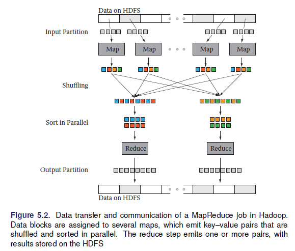
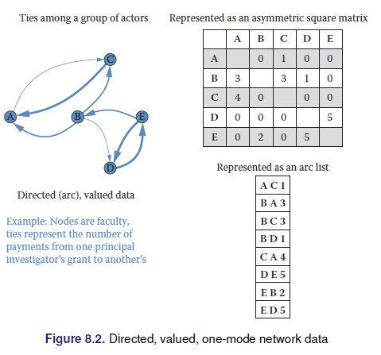

# Introducción al Big Data
[comment]: <> (Principalmente de: BIG DATA AND SOCIAL SCIENCE, Jeff Gill)

## Definiendo al Big Data

De forma simple el Big Data se define como:

**DATA>RAM**

O de forma mas literal "cualquier cosa demasiado grande para caber en su computadora."

La Asociación Americana de Investigación de Opinión Pública menciona: "El término" Big Data "es una descripción imprecisa de un conjunto rico y complicado de características, prácticas, técnicas, cuestiones éticas y resultados, todos asociados con los datos".

## Las 5 V en el Big Data

* Velocidad
* Volumen
* Valor
* Variedad
* Veracidad

## Ciclo de vida de un proyecto de análisis de datos

Se pueden identificar 4 fases:

1. Clarify: (Clarificar) Llegar a familiarizarse con los datos
2. Develop: (Desarrollar) Crear un modelop de trabajo
3. Productize: (Producir) Automatizar e integrar 
4. Publish: (Publicar) Socializar

Estas fases pueden contener nodos adicionales según el proyecto:

0. Subset: Extraer los datos a explorar, los datos de trabajo
1. Clarify: (Clarificar) Llegar a familiarizarse con los datos
2. Develop: (Desarrollar) Crear un modelop de trabajo
    *. Scale Up: Generalizar a la base de datos completa
3. Productize: (Producir) Automatizar e integrar 
4. Publish: (Publicar) Socializar

Otros ciclos de trabajo puedes ser:

1. Identificar el problema
2. Diseño del requerimiento de datos
3. Procesar los datos
4. Desarrollo del análisis sobre los datos
5. Visualizar los datos

## Inferencia y Big Data

El objetivo de la inferencia es poder decir algo de la población objetivo a partir de la información disponibles. Se debe tener en cuenta los tipos de estudio provenientes; ya sean de encuestas probabilísticas, diseño experimentales o estudios de observación. Se debe estar seguro de la calidad de la base de datos proveniente, ya sean estos los errores de muestreo, procesos de calibración, ponderación, post estratificación en el caso de muestreo o el el propensity score y la estratificación principal para repara diseño experimentales rotos.

Se puede distinguir tres metas en el proceso de inferencia:

* Descriptivo
* Causal
* Predictivo

### Descriptivo
La estadística descriptiva puede ser; (1) a un nivel simple de descripción de una base de datos sin la búsqueda de querer expandir los resultados (registros administrativos, censos, estudios de observación) o (2) para encuestas probabilisticas, realizar las estimaciones de la muestra con sus respectivos errores muestrales y a partir de estas estimaciones describir a la población

> **Ejemplo:** El INE estima a partir de la EH-2018 que la incidencia de pobreza moderadara en Bolivia para el 2018 alcanza el ...%

Ejemplos como este muestra que el propósito es puramente descriptivo en cuanto a la pobreza. 

### Causal
Muchos investigadores buscan explorar hipótesis, aveces originadas en la teoria o en alguna relación observada de forma empírica, con la idea central de permitir la inferencia causal. 

La data para esto proviene de diseños experimentales o fuertes estudios no experimentales (cuasi-experimentales), el interés de estos estudios es principalmente encontrar el efecto de de una variable entre otra. 

$$X \rightarrow Y$$
 Aspecto que es logrado fácilmente mediante los diseños experimentales. En este tipo de estudio el componente descriptivo no es tan importante como el metodo para identificar la causalidad. Es importante diferenciar en este punto *la causalidad de la correlación*. 
 
> **Ejemplo:** (3ie) Este informe se basa en un estudio de Dupas, Duflo y Kremer que se realizó en colaboración con el gobierno de Ghana. El estudio examinó los impactos a mediano plazo de otorgar becas de cuatro años a estudiantes que no podían matricularse en escuelas secundarias superiores (SHS) debido a limitaciones financieras. Los investigadores encontraron que el programa de becas tuvo un impacto significativo en el logro educativo y las habilidades cognitivas, particularmente entre las niñas. El programa también tuvo un mayor impacto en las tasas de finalización de SHS de las niñas en términos porcentuales.

> **Ejemplo:** UDAPE el 2013 realizó el calculo del impacto de la renta dignidad en Bolivia empleando el método de regresión discontinua un método cuasi-experimental.
 
Una de las debilidades principales de estos estudios es la falta o poca de validez  externa, es decir, es dificil poder generalizar los resultados. 

  * Métodos cuasi-experimentales
    + Diferencia en diferencia
    + Propensity Score Matching (PSM) Probit. 
    + Variables intrumentales
    + Modelos estructurales
    + Regresión Discontinua.

### Predictivo
El pronóstico o predicción tiene un rol diferenciado según la ciencia de aplicación, teniendo un rol significativo dentro de las estadística oficiales, principalmente en lo social (proyecciones poblacionales) y económico (indicadores macroeconómicos), principalmente para hacedores de política, gobernates y empresarios. Similar a
En la configuración de inferencia causal, es de suma importancia que conozcamos el proceso que generó los datos, y podemos descartar cualquier mecanismo de selección sistemática desconocido o no observado.

> **Ejemplo:** El Institute of Global Health, Faculty of Medicine, University of Geneva tiene una página web que realiza pronosticos por país para los casos de COVID-19.  [Enlace](https://renkulab.shinyapps.io/COVID-19-Epidemic-Forecasting/)

## Calidad de dato y Big Data

La mayoría de los datos en el mundo real son ruidosos, inconsistentes y adolecen de valores perdidos, independientemente de su origen. Incluso si la recopilación de datos es barata, los costos de crear datos de alta calidad a partir de la fuente (limpieza, conservación, estandarización e integración) son considerables. La calidad de los datos se puede caracterizar de múltiples maneras:

* **Precisión:** ¿qué tan precisos son los valores de los atributos en los datos?
* **Integridad:** ¿están completos los datos?
* **Consistencia:** ¿Cuán consistentes son los valores en y entre las bases de datos?
* **Puntualidad:** ¿qué tan oportunos son los datos?
* **Accesibilidad:** ¿están disponibles todas las variables para el análisis?

Los cientistas de datos tienen décadas de experiencia en la transformación de datos desordenados, ruidosos y no estructurados en un conjunto de datos bien definido, claramente estructurado y probado en calidad. El pre procesamiento es un proceso complejo y que lleva mucho tiempo porque es *práctico*: requiere juicio y no puede automatizarse de manera efectiva. Un flujo de trabajo típico comprende múltiples pasos desde la definición de datos hasta el análisis y termina con el filtrado. Es difícil exagerar el valor del pre-procesamiento para cualquier análisis de datos, pero esto es particularmente cierto en big data. Los datos deben analizarse, estandarizarse, deduplicarse y normalizarse.

* **Análisis (parsing):** Exploración de datos
* **Estandarización (Standardization):** Identificar variables que requieren transformación y ajustes.
* **Duplicación:** Consiste en eliminar registros redundantes
* **Normalización (Normalization):** Es el proceso de garantizar que los campos que se comparan entre archivos sean lo más similares posible en el sentido de que podrían haber sido generados por el mismo proceso. Como mínimo, se deben aplicar las mismas reglas de estandarización a ambos archivos.

## Captura y preservación
Se refiere al proceso de obtener la información de las distintas fuentes posibles y luego pasar a un proceso de preservacion. 

### Fuentes convencionales
Estas estan basadas en la información que se distribuye de forma tradicional mediante bases de datos estructuradas, normalmente estas las distribuyen instituciones con amplios conocimientos en la gestion de bases de datos, para el caso de Bolivia se puede citar algunas: 

* Instituto Nacional de Estadística
* SNIS
* UDAPE

### Datos web y APIs

Referirse al capítulo 2 de scraping web, estos son los mecanismos para extraer información en internet

### Record Linkage

Se refiere al proceso de concatenar o unir observaciones dispuestas en múltiples bases de datos.

  * Puede ser usado para compensar la falta de información
  * Se usa para crear estudios longitudinales
  * Se pueden armar seudo-paneles

Esto permite mejorar la cobertura (append), ampliar las temáticas de estudio (merge). 

  * Matching: Une información a partir de una clave, existen muchos problemas con claves tipo texto.
  * Aproximaciones a reglas para hacer math: Definir criterios para posibilitar el match basados en reglas, distancias cercanas, etc.
  * Match basados en probabilidad: Fellegi–Sunter method

### Bases de datos

Una vez que los datos fueron recolectados y enlazados entre diferentes fuentes, es necesario guardar la información. Ahora se siscute las alternativas para guardar la información. 

  * DBMS (databasemanagement systems) Sistema de gestión de base de datos: Decidir que herramienta usar segun la dimensión de los archivos.
  

  
  * Bases de datos espaciales
  * Múltiples formatos: https://juliael.carto.com/

### Programando con Big Data

  * MapReduce: map, shuffle y reduce

  * Apache hadoop MapReduce (Hadoop Distributed File System HDFS)
  * Apache Spark
  

## Análisis y modelado

### Machine learning

**¿Machine learning = Statistics?**

Veran que muchos métodos discutidos a lo largo de su formación como estadisticos aparecen dentro del matching learning y que son llamados con otros nombres. 

Al pensar en machine learning debemos asociarlo directamente con procesos computacionales, muchos otros conceptos giran al rededor de esta idea como la inteligencia artificial. Proceso de machine learning hoy:

  * Permiten manejar autos de forma autonoma
  * Puede recomendar libros, amistades, música, etc
  * Identificar drogas, proteinas y ciertos genes
  * Se usa para detectar ciertos tipos de cancer y otras enfermedades médicas
  * Ayudan a conocer que estudiantes necesitan un apoyo adicional 
  * Ayudan a persuadir por que candidato votar en las elecciones.

#### El proceso del machine learning
  
  * Entender el problema y la meta
  * Formular esto como un problema de machine learning
  * Explorar y preparar los datos
  * Feature engineeing 
  * Selección del método
  * Evaluación
  * Deployment

#### Formulación del problema
En ML existen 2 grandes categorías

  1. Aprendizaje supervisado: Existe una $Y$ que queremos predecir o clasificar a partir de los datos. El fin es el ajuste y la generalización
    * Clasificación ($Y$ cualitativa)
    * Predicción 
    * Regresión ($Y$ cuantitativa)
    
  2. Aprendizaje no supervisado: No existe una variable objetivo, se quiere conocer, entender las asociaciones y patrones naturales en los datos. 
    * Clustering
    * PCA, MCA
    

### Análisis de texto: Entendiendo lo que la gente escribe

  * Clasificación de documentos
  * Análisis de sentimientos
  * Etiquetado de discursos
  
### Networks

## Inferencia y ética

### Información y visualización

> Los usuarios pueden escanear, reconocer, comprender y recordar representaciones visualmente estructuradas más rápidamente de lo que pueden procesar representaciones no estructuradas

> La ciencia de la visualización se basa en múltiples campos, como la psicología perceptiva, las estadísticas y el diseño gráfico para presentar información

> La efectividad de una visualización depende tanto de las necesidades de análisis como de los objetivos de diseño.

> El diseño, el desarrollo y la evaluación de una visualización se guían por la comprensión de los antecedentes y las metas del público objetivo.

El desarrollo de una visualización efectiva es un proceso iterativo que generalmente incluye los siguientes pasos:

  * Especificar las necesidades del usuario, tareas, requisitos de accesibilidad y criterios para el éxito.
  * Preparar datos (limpiar, transformar).
  * Diseñar representaciones visuales.
  * Interacción de diseño.
  * Planifique el intercambio de ideas, procedencia.
  * Prototipo / evaluación, incluidas las pruebas de usabilidad.
  * Implementar (supervisar el uso, proporcionar soporte al usuario, gestionar el proceso de revisión).

#### Dashboards

#### Elementos

#### Datos espaciales

* Datos temporales
* Datos jerarquicos
* Datos de redes
* Datos de texto

Tarea: resumir los siguientes puntos del libro: Big Data and Social Science, Ian Foster.

### Error e inferencia
### Privacidad y confidencialidad
### Workbooks

## Ejercicios Propuestos

1. Explorar los métodos cuasi-experimentales que existen 
2. Buscar informacion respecto a: los matriculados en educacion regular y universidad por año y departamento en Bolivia
3. Empleando la fuente anterior, generar en R el có
digo que cargue el archivo encontrado 
4. Buscar dos papers (1) donde se uso machine learning y (2) análisis de texto y comentar con al menos 5000 caractéres
5. Buscar ejemplos (al menos uno) de bases de datos, páginas web u otros asociados a datos que no respeten los principios de privacidad y confidencialidad.