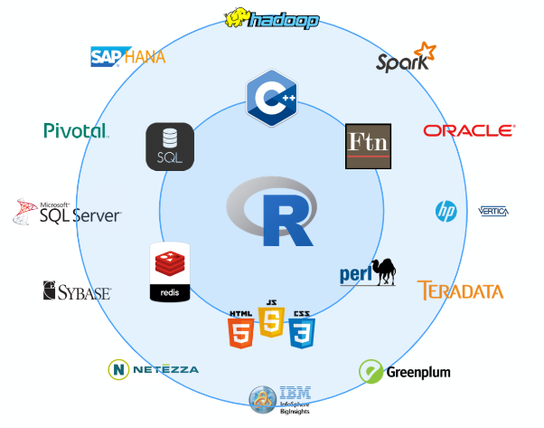

# Big Data en R 
[comment]: <> (Principalmente Big Data Analytics with R, Simon Walkowiak capitulo 3)

R en un software que se adapta perfectamente con las fases del ciclo de vida de los proyectos de datos, ofreciendo herramientas para cada una de ellas; Entre las mas interesantes, R Markdown, Shiny, sweave, etc.

Adicionalmente existen múltiples librerías que permite trabajar con otros software, principalmente los asociados a bases de datos.



En el capitulo 1 se enfatiza el uso de R para el manejo, procesamiento y análisis de bases de datos, sumado a esto el conocimiento de distintas estadísticas en base a los cursos de formación, en este capitulo se buscar unir ambos tópicos y explicar como usar el poder del modelado matemático y de datos en R, considerando bases de datos **grandes**, esto sin necesidad de recurrir a otros equipos. 

Lo que se espera a partir de este capitulo es: 

  * Conocer las limitaciones de R para el Big Data y como ellas pueden resolverse
  * El uso de las librerías ff, ffbase, ffbase2, y bigmemory, para el manejo de la memoria del equipo
  * El uso de métodos estadísticos para objetos grandes en R, a través de las librerías bigglm y ffbase
  * Mejorar la velocidad del procesamiento de datos con librerías que permiten la computación paralela (parallel computing)
  * Manipulación de datos más rápidos con el uso de la librería data.table

## Limitaciones en R
A manera que uno va aprendiendo mas del R en la universidad o en el trabajo se valora cada vez mas la flexibilidad de R, su constante crecimiento, la ventaja de ser de código abierto, etc. Sin embargo, es importante tener en cuenta las limitaciones de R:

  * Los datos se ajustan a la RAM
  * R es generalmente muy lento comparado con otros lenguajes

### Memoria

  * R permite trabajar con bases de datos que no superen el 50-60% de la RAM de la computadora
  * Existen soluciones en R sin tener que recurrir aun a plataformas como; Microsoft Azure, Amazon EC2, or Google Cloud Platform.
  * Existe también la opción de trabajar con RStudio-Cloud, https://rstudio.cloud/plans/free

### Velocidad de procesamiento

  1. R se considera un lenguaje interpretado y, como tal, su ejecución de código más lenta viene por definición.
  2. Procesos linea por linea 
  3. El bajo rendimiento del código R puede deberse al hecho de que el lenguaje no está formalmente definido

## A los límites de la memoria y más allá

### Transformacion y agregación de datos con la librería ff y ffbase 

```{r,eval=F}
rm(list=ls())
install.packages("ff")
install.packages("ffbase")
#install.packages("ffbase2") / github
```

```{r,eval=FALSE}
library(ff)
library(ffbase)
setwd("C:\\Users\\ALVARO\\Desktop\\_data\\bigdata")
bd1<-read.csv("200613COVID19MEXICO.csv",sep=",",header=T)
object.size(bd1)/1000000


#paso 1: tener un directorio para archivos temporales de ff
system("mkdir ffdf")
#paso 2: definir la carpeta temporal
options(fftempdir="C:\\Users\\ALVARO\\Desktop\\_data\\bigdata\\ffdf")
#paso 3: Cargar la base de datos

bd2<-read.csv.ffdf(file="200614COVID19MEXICO.csv",sep=",",header=T,
                   next.rows=100000,colClasses=NA,VERBOSE=F)

bd3<-read.csv.ffdf(file="200614COVID19MEXICO.csv",sep=",",header=T,
                   first.rows=-1,colClasses=NA,VERBOSE=T)
bd4<-read.csv.ffdf(file="200614COVID19MEXICO.csv",sep=",",header=T,
                   next.rows=10000,colClasses=NA,VERBOSE=T)
bd5<-read.csv.ffdf(file="201115COVID19MEXICO.csv",sep=",",header=T,
                   next.rows=100000,colClasses=NA,VERBOSE=F)


object.size(bd1)/1000000 # CSV DE R
object.size(bd2)/1000000 # CSV.FFDF 100000
object.size(bd3)/1000000 # CSV.FFDF TODO
object.size(bd4)/1000000 # CSV.FFDF 1000

str(bd2)
#USO DE LAS FFDF

table(bd2$SEXO)
table(bd5$SEXO)

install.packages("tictoc")
library(tictoc)
tic("R")
table(bd1$EDAD,bd1$SEXO)
toc()

tic("ffdf")
table(bd2$EDAD,bd2$SEXO)
toc()

tic("ffdf bd5")
table(bd5$EDAD,bd5$SEXO)
toc()

tic("ffdf table")
table.ff(bd2$EDAD,bd2$SEXO)
toc()
```

Funciones para objetos ff

```{r,eval=F}
mean(bd1$EDAD)
mean(bd2$EDAD)
mean(bd5$EDAD)
median(bd2$EDAD)
median(bd1$EDAD)

#sobre la bd2
library(doBy)
library(dplyr)

res0<-bd1 %>% group_by(PAIS_NACIONALIDAD,SEXO) %>% summarise(mean(EDAD))

bd2df<-as.data.frame(bd2)
bd5df<-as.data.frame(bd5)

object.size(bd2df)/10^6
object.size(bd5df)/10^6
bd2df %>% group_by(PAIS_NACIONALIDAD,SEXO) %>% summarise(mean(EDAD))

#bd2 %>% group_by(PAIS_NACIONALIDAD,SEXO) %>% summarise(mean(EDAD))
summaryBy(EDAD~PAIS_NACIONALIDAD+SEXO,FUN=mean,data=bd1)
summaryBy(EDAD~PAIS_NACIONALIDAD+SEXO,FUN=mean,data=bd2df)

tapply(bd1$EDAD, bd1$PAIS_NACIONALIDAD, mean)
tapply(bd2df$EDAD, bd2df$PAIS_NACIONALIDAD, mean)

res<-ffdfdply(bd2,split=bd2$SEXO,FUN=function(x){
  summaryBy(EDAD~PAIS_NACIONALIDAD+SEXO,FUN=mean,data=x)
})
as.data.frame(res)

ss1<-subset(bd1,EDAD>60)
ss2<-subset(bd2,EDAD>60)
ss3<-subset.ffdf(bd2,EDAD>60)
ss4<-subset(bd5,EDAD>60)

#memoria en R
#object.size("a")
#memory.size()
#memory.limit()
#(memory.size()/memory.limit())*100
#memory.profile()

#guardar objetos ffdf
save.ffdf(res)
rm(res)
load.ffdf("ffdb")
#convirtiendo a ff
dd<-as.ffdf(bd1)

#forma lenta
bd1$FECHA_ACTUALIZACION<-as.factor(bd1$FECHA_ACTUALIZACION)
str(bd1)

#forma rápida
i <- sapply(bd1, is.character)
bd1[,i] <- lapply(bd1[,i], as.factor)
str(bd1)
dd<-as.ffdf(bd1)
```


### Modelos GLM con la las librerias ff y ffbase

```{r,eval=F}
install.packages("biglm")
library(ff)
library(ffbase)
library(biglm)

model1<-lm(EDAD~UCI,data = bd1)

model2<-lm(EDAD~UCI,data = bd2)

model3<-bigglm.ffdf(EDAD~SEXO,data = dd)

summary(model1)
summary(model2)
summary(model3)
```


### Expandiendo la memoria con la libreria bigmemory

```{r,eval=F}
rm(list=ls())
library(bigmemory)
#limitación de bigmemory, todos los variables de la base de datos de interés deben ser numéricas.
load("C:\\Users\\ALVARO\\Documents\\GitHub\\EST-383\\data\\oct20.RData")
bd1<-computo[,13:25]
str(bd1)
object.size(bd1)/10^6

bd2<-as.big.matrix(as.matrix(bd1))

object.size(bd1)/10^6
object.size(bd2)/10^6

object.size(bd1)/object.size(bd2)

class(bd2)
class(bd1)
#xx<-read.big.matrix(".csv",sep=",")
#alternativamente read.big.matrix
dim(bd2)

dimnames(bd2)

head(bd2)
summary(bd1)
summary(bd2)
mean(bd2[,1])
summary(bd2[,2])

names(bd2)
dimnames(bd2)
lm(CC~MNR,data=bd2)

library(bigtabulate)
library(biganalytics)
library(biglm)
library(bigstatsr)
library(bigalgebra) # salio de R el 2020
library(bigpca)# salio el 2018 de R
reg0<-bigglm.big.matrix(CC~MNR,data=bd2)
summary(reg0)
reg<-bigglm.big.matrix(CC~FPV,data=bd2)
summary(reg)
class(bd2)
```


## Parallel R
Esta sección se enfoca en los métodos de computación paralelo, de tal forma que se pueda controlara la paralelizacion en una sola maquina.

El objetivo es poder aprovechar los cores que tiene disponible los PC en la actualidad, R por defecto solo trabaja en una.

  * [Recursos online En R](https://cran.r-project.org/web/views/HighPerformanceComputing.html)
  * Un libro acerca del tema [(aquí)](https://www.oreilly.com/library/view/parallel-r/9781449317850/)

Antes una función para calcular el tiempo de procesamiento. 
```{r,eval=F}
rm(list=ls())
teval<-function(...){
  gc()
  start<-proc.time()
  result<-eval(...)
  finish<-proc.time()
  return(list(Duration=finish-start,Result=result))
  }
```

Veamos el rendimiento de lo visto antes.
```{r,eval=F}
library(ff)
library(ffbase)
library(bigmemory)
library(biganalytics)
mr<-matrix(rnorm(10000000*10),nrow = 10000000,ncol=10)
mr<-cbind(mr,binom=rbinom(10000000,5,0.7))
mbm<-as.big.matrix(mr)
mff<-as.ffdf(as.data.frame(mr))

class(mr)
class(mbm)
class(mff)

object.size(mr)/10^6
object.size(mbm)/10^6
object.size(mff)/10^6

teval(colMeans(mr))
teval(colmean(mbm))
#teval(colMeans(mff))

teval(apply(mr,2,mean))
teval(apply(mbm,2,mean))
teval(apply(mff,2,mean))

resul<-list()
teval(
for(i in 1:ncol(mff)){
 resul[[i]]<-mean.ff(mff[[i]]) 
}
)
teval(sapply(mff,mean))


teval(tapply(mr[,1], mr[,11], mean))
teval(tapply(mbm[,1], mbm[,11], mean))
teval(tapply(mff[[1]], mff[[11]], mean.ff))

aux<-matrix(NA,6,10)
teval(
for(i in 1:10){
  for(j in unique(mff[,11])){
    aux[j+1,i]<-mean(mff[mff[,11]==j,i])  
  }  
}
)
```

### Libreria parallel

Ahora sí, veamos la librería parallel y snow.

  * Disponible desde la versión 2.14.0 
  * Existen otras populares; multicore, snow (Simple Network of
Workstations). La primera descontinuada y la segunda limitada.
  * El manual https://stat.ethz.ch/R-manual/R-devel/library/parallel/doc/parallel.pdf
  
  
```{r,eval=F}
library(parallel)
library(snow)
#funciones propias 
mclapply()#no funciona completamente en windows
parLapply()
library(help=parallel)
library(help=snow)
#viendo los cores disponibles
detectCores()
#definiendo un cluster de trabajo
#SOCK usa Rscript para lanzar más copias de R (en el mismo host u opcionalmente en otro lugar)
#FORK makeForkCluster bifurca a los trabajadores en el host actual (que hereda el entorno de la sesión actual)  (NO WINDOWS)

cl <- makeCluster(3, type = "SOCK")
stopCluster(cl)

cl <- makeCluster(2, type = "SOCK")
teval(parApply(cl,mr,2,mean))
stopCluster(cl)

cl <- makeCluster(3, type = "SOCK")
teval(parApply(cl,mr,2,mean))
stopCluster(cl)

cl <- makeCluster(4, type = "SOCK")
teval(parApply(cl,mr,2,mean))
stopCluster(cl)

#parApply(cl,mff[[1]],1,mean)
#parApply(cl,mbm,2,mean)

A<-matrix(10^6,10)
B<-matrix(10^6,10)
C<-matrix(10^6,10)
mclapply(X=list(A,B,C),FUN=mean,mc.preschedule = F,affinity.list = c(1,1,2))
mclapply(X=list(A,B,C),FUN=mean)
```
