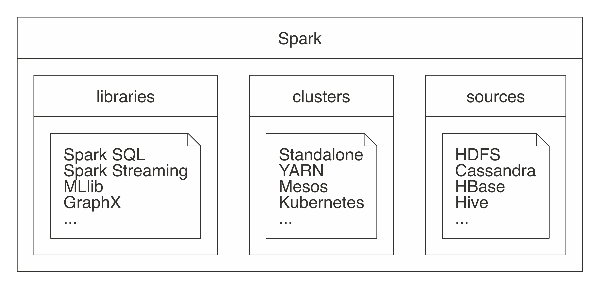

# R y Spark

## Introducción

En este capítulo emplearemos Spark junto con R para el procesamiento de datos. Spark es un framework que permite realizar procesos de división y paralelismo en un equipo o múltiples equipos. 

### Hadoop
Google (2004) publicó un nuevo documento que describe cómo realizar operaciones en todo el Sistema de archivos de Google, un enfoque que se conoció como MapReduce. Como era de esperar, hay dos operaciones en MapReduce: map y reduce. La operación de map proporciona una forma arbitraria de transformar cada archivo en un nuevo archivo, mientras que la operación de reduce combina dos archivos. Ambas operaciones requieren un código de computadora personalizado, pero el marco MapReduce se encarga de ejecutarlas automáticamente en muchas computadoras a la vez. Estas dos operaciones son suficientes para procesar todos los datos disponibles en la web, al tiempo que proporcionan suficiente flexibilidad para extraer información significativa de la misma.

### Spark 

En 2009, Apache Spark comenzó como un proyecto de investigación en AMPLab de UC Berkeley para mejorar MapReduce. Específicamente, Spark proporcionó un conjunto más rico de verbos más allá de MapReduce para facilitar la optimización del código que se ejecuta en múltiples máquinas. Spark también cargó datos en la memoria, lo que hace que las operaciones sean mucho más rápidas que el almacenamiento en disco de Hadoop



Componetes:

  1. Spark Core: Base donde se apoya el resto de los componentes
  2. Spark SQL: Procesamiento de dato estructurados y no estructurados
  3. Spark streaming: Procesamiento de datos en tiempo real. 
  4. Spark MLLib: Machine learning
  5. Spark graph: Procesamiento de grafos

Algunos conceptos importantes

> HDFS: Sistema de ficheros

### Sparklyr
Oficialmente, sparklyr es una interfaz R para Apache Spark. Está disponible en CRAN y funciona como cualquier otro paquete de CRAN, lo que significa que es independiente de las versiones de Spark, es fácil de instalar, sirve a la comunidad R, abarca otros paquetes y prácticas de la comunidad R, y así sucesivamente. Está alojado en GitHub y tiene licencia de Apache 2.0, que le permite clonar, modificar y contribuir de nuevo a este proyecto.

## Librería dplyr

```{r, eval=FALSE}
#install.packages("dplyr")
library(dplyr)
load(url("https://github.com/AlvaroLimber/EST-384/raw/master/data/eh19.RData"))
## Obtener el promedio de edad por sexo de los jefes de hogar
aux<-eh19p[eh19p$s02a_05=="1.JEFE O JEFA DEL HOGAR",c("s02a_03","s02a_02")]
aux<-subset(eh19p,s02a_05=="1.JEFE O JEFA DEL HOGAR",c("s02a_03","s02a_02"))
tapply(aux$s02a_03, aux$s02a_02, mean)
#dplyr
# %>% operador pipe 
t1<-eh19p %>% filter(s02a_05=="1.JEFE O JEFA DEL HOGAR") %>% group_by(s02a_02) %>% 
summarise(mean(s02a_03))

t2<-eh19p %>% rename(sexo=s02a_02,edad=s02a_03,paren=s02a_05) %>%  filter(paren=="1.JEFE O JEFA DEL HOGAR") %>% group_by(sexo) %>% 
summarise(edad=mean(edad))

## Obtener el promedio de edad y años de educación por sexo de los jefes de hogar
t3<-eh19p %>% rename(sexo=s02a_02,edad=s02a_03,paren=s02a_05) %>%  filter(paren=="1.JEFE O JEFA DEL HOGAR") %>% group_by(sexo) %>% 
summarise(edad=mean(edad),aestudio=mean(aestudio,na.rm = T),med_aestudio=median(aestudio,na.rm = T),n=n())

eh19p %>% rename(sexo=s02a_02,edad=s02a_03,paren=s02a_05) %>%  filter(paren=="1.JEFE O JEFA DEL HOGAR") %>% group_by(depto,area,sexo) %>% 
summarise(edad=mean(edad),aestudio=mean(aestudio,na.rm = T),med_aestudio=median(aestudio,na.rm = T),n=n())

# ctr+mayus+m %>% 
eh19p<-eh19p %>% mutate(jefe=(s02a_05=="1.JEFE O JEFA DEL HOGAR"))


eh19p %>% mutate(jefe=(s02a_05=="1.JEFE O JEFA DEL HOGAR")) %>% group_by(jefe,s02a_02) %>% summarise(mean(ylab,na.rm = T))

eh19p<-eh19p %>% rename(sexo=s02a_02)

names(eh19p)[6]<-"edad"
# personas entre 15 y 30 años, por departamento y sexo, el promedio de horas a la semana de trabajo, años de educación y el mínimo y máximo de ingresos laborales y su rango
eh19p %>% filter(edad>=15 & edad<=30) %>% group_by(depto,sexo) %>% summarise(horas=mean(tothrs,na.rm = T),edu=mean(aestudio,na.rm = T),min_ylab=min(ylab,na.rm = T),max_ylab=max(ylab,na.rm = T)) %>% mutate(rango=max_ylab-min_ylab)

eh19p %>% slice_sample(n=20) %>% select(edad) %>% mutate(gedad=cut(edad,c(0,14,25,60,100),include.lowest =T))

eh19p %>% mutate(gedad=cut(edad,c(0,5,14,25,60,100),include.lowest =T)) %>% group_by(gedad) %>% summarise(mean(aestudio,na.rm=T))
## Por departamento, área y sexo de los jefes del hogar, mostrar el porcentaje de hogares con piso de tierra.
aux<-eh19p %>% filter(jefe==T) %>% select(folio,sexo,area,depto)

aa<-attributes(eh19v)
aa$variable.labels
unique(eh19v$s01a_09)

aux2<-eh19v %>% mutate(tierra=s01a_09=="1.TIERRA") %>% select(folio,tierra)
head(aux2)

bd<-merge(aux,aux2)## 1:1 (), n:1 , 1:n , n:n (X 30) (Y 20) XY 600

#x
#Nombre materia  nota ci
#Juan    m1      45   123
#Juan    m2      57   123
#Juan    m3      57   123
#
#y
#Nombre  ci   plan_estudio
#Juan    123  2012
#Maria   124  2007

#merge(x,y,by=c("ci","Nombre"),all=T)

#xy
#Nombre materia  nota ci  plan_estudio
#Juan    m1      45   123  2012
#Juan    m2      57   123  2012  
#Juan    m3      57   123  2012
#Maria                124  2007

bd %>% group_by(depto,area,sexo) %>% summarise(Piso_Tierra=mean(tierra)*100)
#se recomienda explorar el comando merge, y la variable folio es la llave para la unión de las bases de datos

# Ejercicio. Obtener una tabla por departamento y área con la siguiente información
#  * % de hogares pobres extremos
#  * % de hogares con jefes del hogar mujeres
#  * Promedio de personas en el hogar
load(url("https://github.com/AlvaroLimber/EST-384/raw/master/data/eh19.RData"))
bd<-eh19p %>% filter(s02a_02=="2.Mujer") %>% mutate(pobreza=pext0=="Pobre extremo",mujer=s02a_05=="JEFE O JEFA DEL HOGAR" ) %>% group_by(depto,area) %>%  summarise(pobre=mean(pobreza)*100,mujer1=mean(mujer))
bd

eh19p %>% mutate(pobreza=(pext0=="Pobre extremo")*1,jefa=(s02a_05=="1.JEFE O JEFA DEL HOGAR" & s02a_02=="2.Mujer")*1, nper=1) %>% group_by(depto,area,folio) %>% summarise(nper=sum(nper),jefa=max(jefa),pobreza=max(pobreza)) %>% group_by(depto,area) %>% summarise(pobreza=mean(pobreza,na.rm=T)*100,jefa=mean(jefa)*100,nper=mean(nper)) 

t1<-eh19p %>% mutate(pobreza=(pext0=="Pobre extremo")*1,jefa=(s02a_05=="1.JEFE O JEFA DEL HOGAR" & s02a_02=="2.Mujer")*1, nper=1) %>% group_by(depto,area,folio) %>% summarise(nper=sum(nper),jefa=max(jefa),pobreza=max(pobreza)) 

t2<-t1 %>% group_by(depto,area) %>% summarise(pobreza=mean(pobreza,na.rm=T)*100,jefa=mean(jefa)*100,nper=mean(nper)) 
t2

xtable::xtable(t2)
knitr::kable(t2)
```

## Arrancando Spark

### Prerequisitos

  * R
  * RStudio
  * Java 8

```{r,eval=FALSE}
system("java -version")
```

### Instalación

```{r,eval=F}
#instalar la librería sparlyr
install.packages("sparklyr")
#Habilitando la librería
library(sparklyr)
#versiones disponibles
spark_available_versions()
#versiones instaladas
spark_installed_versions()
#instalando spark desde R
spark_install("3.0")
#spark_install(version="2.3")
```


### Soluciones a problemas de instalación
```{r,eval=FALSE}
install.packages("rJava")
library(rJava)
```


### Creando una sesión en Spark

```{r,eval=F}
#inicia la sesión
sc <- spark_connect(master = "local")

#sc <- spark_connect(master = "local", spark_home = "C:\\Users\\ALVARO\\AppData\\Local\\spark",version="3.0.1")
```

### Interface web

```{r,eval=F}
spark_web(sc)
```

  * http://localhost:4040/jobs/
  * http://127.0.0.1:4040/executors/

  + Jobs
  + Stages
  + Storage
  + Environment
  + Executors
  + SQL


### Configuración

```{r,eval=F}
conf <- spark_config()
  conf$`sparklyr.shell.driver-memory` <- "2G"
  #conf$spark.memory.fraction <- 0.8 
  #spark_home="C:\\Users\\ALVARO\\AppData\\Local\\spark\\spark-2.4.3-bin-hadoop2.7"
  #conf$sparklyr.gateway.port <- 9090
#conección  

#apagar conexión
spark_disconnect(sc)

spark_disconnect_all()
```


## Análisis con Spark


### Importando los datos
Por lo general, importar significa que R leerá los archivos y los cargará en la memoria; cuando se usa Spark, los datos se importan a Spark, no a R.


Colección de documentos

```{r,eval=F}
#csv/importaciones
sp_importaciones<-spark_read_csv(sc,
  name="importaciones",
  path = "C:\\Users\\ALVARO\\Desktop\\db_bolivia\\importaciones\\importaciones_csv")
###########
#esquema
###########
top_rows <- read.csv("C:\\Users\\ALVARO\\Desktop\\db_bolivia\\importaciones\\importaciones_csv\\1993.csv",sep=",", nrows = 5)
spec_with_r <- sapply(top_rows, class)
spec_with_r[6]<-"factor"

sp_importaciones2<-spark_read_csv(sc,
  name="importaciones2",
  path = "C:\\Users\\ALVARO\\Desktop\\db_bolivia\\importaciones\\importaciones_csv",
  columns = spec_with_r)
# memoria
object.size(sp_importaciones)
```

Comando copy_to

```{r,eval=F}
m1<-data.frame(matrix(rnorm(10^7),ncol=20))
object.size(m1)/(10^6)
sp_m1<-copy_to(sc,m1)
rm(m1)

load("C:\\Users\\ALVARO\\Documents\\GitHub\\EST-383\\data\\oct20.RData")
object.size(computo)/10^6
sp_computo<-copy_to(sc,computo)
sp_eh19p<-copy_to(sc,eh19p)
rm(computo)
```

Documento específico

```{r,eval=F}
sp_covid<-spark_read_csv(sc,
  name="covid",
  path = "C:\\Users\\ALVARO\\Desktop\\db_bolivia\\bigdata\\200614COVID19MEXICO.csv")

sp_covid2<-spark_read_csv(sc,
  name="covid2",
  path = "C:\\Users\\ALVARO\\Desktop\\db_bolivia\\bigdata\\201115COVID19MEXICO.csv")
```

### Librería DPLYR (Gramática de manipulación de datos)

  * https://cran.r-project.org/web/packages/dplyr/vignettes/dplyr.html


Eliminar un objeto en spark

```{r,eval=FALSE}
library(dplyr)
db_drop_table(sc,"importaciones2")
db_drop_table(sc,"m1")
```

DPLYR en Spark

```{r,eval=FALSE}
sp_importaciones %>% group_by(GESTION) %>% count()
sp_covid2 %>% count()

eh19v %>% group_by(depto) %>% count() # R
sp_eh19v %>% group_by(depto) %>% count() # Spark
```


```{r,eval=F}
library(dplyr)
load(url("https://github.com/AlvaroLimber/EST-383/raw/master/data/oct20.RData"))
names(computo)[1]<-"pais"
##############################
### Columnas -> variables
##############################
#cambio de nombre de las variables
computo<-computo %>% rename(mas=`MAS - IPSP`,cc=CC)
computo<-computo %>% rename(idep=`Número departamento`,imun=5)
names(computo)
# Selección de variables
bd1<-computo %>% select(pais,cc,mas)
head(bd1)
# Crear nuevas variables
bd1<-bd1 %>% mutate(a=1,s_mas_cc=cc+mas,raiz_mas=sqrt(mas),lcc=log(cc))
bd1<-bd1 %>% mutate(mas100=mas>100,mean_mas=mas>mean(mas))
# ordenando las variables  
bd1<-bd1 %>% relocate(lcc:mas,before=a)#pendiente
bd1[,c("cc","pais","a")]
##############################
### Filas-> Observaciones
##############################
#filtrado
# elección presidencial solo Bolivia 
pv<-computo %>% filter(Elección=="Presidente y Vicepresidente")
pvbol<-computo %>% filter(Elección=="Presidente y Vicepresidente" & pais=="Bolivia")
##############################
### Resumen estadístico
##############################
# summarise
pvbol %>% summarise(media_mas=mean(mas),media_cc=mean(cc),max_mas=max(mas),max_cc=max(cc))
pvbol %>% summarise(p100mas=mean(mas>100)*100,p100cc=mean(cc>100)*100)
# group_by
pvbol %>% group_by(Departamento) %>% summarise(p100mas=mean(mas>100)*100,p100cc=mean(cc>100)*100)

pvbol %>% group_by(Departamento,Provincia) %>% summarise(p100mas=mean(mas>100)*100,p100cc=mean(cc>100)*100)
#count tally
pvbol %>% group_by(Departamento,Provincia) %>% count()
pvbol %>% group_by(Departamento,Provincia) %>% tally()
# encadenamiento masivo
pvbol %>% filter(Departamento=="Beni") %>% select(mas,cc) %>% plot()
pvbol %>% filter(Departamento=="Beni") %>% select(mas,cc) %>% cor()
```

### DPLYR en Spark

```{r,eval=F}
# 0. Habilitar la librería
library(sparklyr)
library(dplyr)
library(ggplot2)
# 1. Conexión con Spark
sc <- spark_connect(master = "local", version = "2.4.3")
# 2. Definir la data (importación)
sp_covid<-spark_read_csv(sc,
  name="covid",
  path = "C:\\Users\\ALVARO\\Desktop\\db_bolivia\\bigdata\\200614COVID19MEXICO.csv")#específico
sp_importaciones<-spark_read_csv(sc,
  name="importaciones",
  path = "C:\\Users\\ALVARO\\Desktop\\db_bolivia\\importaciones\\importaciones_csv")#carpeta

load(url("https://github.com/AlvaroLimber/EST-383/raw/master/data/oct20.RData"))

pvbol<-computo %>% rename(eleccion=Elección) %>% filter(eleccion=="Presidente y Vicepresidente")
sp_pvbol<-copy_to(sc,pvbol)

# 3. Exploración de los datos / ("Modelado")
names(pvbol)
glimpse(sp_pvbol)
glimpse(sp_importaciones)

sdf_describe(sp_importaciones)
sdf_describe(sp_pvbol,c("CC"))
summary(pvbol$CC)

sp_importaciones %>% group_by(DESADU) %>% count()

a1<-sp_importaciones %>% group_by(DESADU) %>% count() %>% collect() # guardar la salida en R

sp_a2<-sp_importaciones %>% group_by(DESADU) %>% count() %>% compute("a2") # guardar la salida en Spark

sp_importaciones %>% group_by(GESTION,DESADU) %>% count()

sp_importaciones %>% group_by(DESADU, GESTION) %>% count()

 
sp_importaciones %>% group_by(DESADU, GESTION) %>% summarise()

sp_importaciones %>% count()

# Generar un cuadro por gestión y producto, respecto el total de peso bruto y guardarlo en R.

t1<-sp_importaciones %>% group_by(GESTION,NANDINA,DESNAN) %>% summarise(peso_ton=sum(KILBRU,na.rm=T)/1000) %>% arrange(GESTION,desc(peso_ton)) %>% collect()

library(DBI)
aux<-dbGetQuery(sc,"Select * from importaciones limit 5")

#lm(FOB~PAG,data=sp_importaciones)

mod1<-sp_importaciones %>% select(FOB,PAG) %>% ml_linear_regression(FOB~.)

# 4. Análisis de los resultados


# 5. Salida. Visualización  

ggplot(sp_importaciones,aes(DESDEPTO))+geom_bar()+facet_wrap(~GESTION)

ggplot(sp_importaciones,aes(DESDEPTO))+geom_bar()

#ggplot(sp_importaciones,aes(KILBRU))+geom_histogram()

library(dbplot)

sp_importaciones %>% dbplot_bar(DESDEPTO)


# Final. Cerrar la conexión a Spark
spark_disconnect_all()
###########################################################
# cargar el pvbol
sp_pvbol<-copy_to(sc,pvbol,name="elecciones")
rm(pvbol)
# interactuar con la base en spark
sp_pvbol %>% count()
t0<-sp_pvbol %>% group_by(Departamento) %>% count()
#collect es para guardar la salida en la memoria de R
t1<-sp_pvbol %>% group_by(Departamento) %>% count() %>% collect()
# compute es para guardar la salida en la memoria de spark
sp_t2<-sp_pvbol %>% group_by(Departamento) %>% count() %>% compute("t2")
# consultas a spark

sp_pvbol %>%  group_by(Departamento,Provincia) %>% summarise(media_mas=mean(mas),media_cc=mean(cc),sd(mas))

# SQL show_query
sp_pvbol %>% group_by(Departamento) %>% count() %>% show_query()

sp_pvbol %>% group_by(Departamento) %>% select(mas,cc) %>% summarise_all(mean) %>% show_query()

# spark SQL
library(DBI)
e10<-dbGetQuery(sc,"Select * from elecciones limit 10")

# figuras 
sp_pvbol %>% select(cc) %>% hist()

library(ggplot2)
ggplot(sp_pvbol,aes(cc))+geom_histogram()
ggplot(sp_pvbol,aes(cc,mas))+geom_point()

# recomendación ml
```


```{r,eval=F}
load("C:\\Users\\ALVARO\\Documents\\GitHub\\EST-383\\data\\oct20.RData")
head(computo)
#filtrado
aux<-computo[computo$País=="Bolivia",] #en R
aux2<-computo %>% filter(País=="Bolivia") 
```


```{r,eval=F}
#spark SQL
library(DBI)
top10 <- dbGetQuery(sc, "Select * from importaciones limit 10")
top10
library(dplyr)
sp_importaciones %>% tally
sp_covid2 %>% tally
oct20 %>% tally
covid_cache <- sp_covid2 %>% 
    compute("covid_ch")
covid_cache %>% tally
```

Para correr con las bases de la parte de importaciones
```{r,eval=F}
#importaciones
dimnames(sp_importaciones)

sp_t1<-sp_importaciones %>% count(GESTION) %>% compute("t1")

aa<-sp_importaciones %>% count(GESTION) %>% collect()
aa<-sp_importaciones %>% count(GESTION,DESDEPTO) %>% collect()
sp_covid2 %>% count(SEXO,NEUMONIA)
sp_covid2 %>% group_by(SEXO) %>% summarise(mean(EDAD),na.rm=T)

ww<-sp_importaciones %>% group_by(GESTION,DESDEPTO,NANDINA) %>% summarise(total=sum(FOB,na.rm=T)) %>% collect()
sp_importaciones %>%  tbl(GESTION)

oct20 %>% select(MAS__IPSP,CC)%>%  summarise_all(mean)
oct20 %>% select(MAS__IPSP,CC)%>%  summarise_all(mean) %>% show_query()
oct20 %>% summarise(qq=quantile(CC,probs=0.5))
oct20 %>% select(MAS__IPSP,CC) %>% ml_corr()

#figuras
oct20 %>% select(CC) %>% hist()

library(dbplot)
oct20 %>% dbplot_histogram(CC,binwidth = 3)
sp_importaciones %>%  dbplot_bar(GESTION)
oct20 %>%  dbplot_raster(CC,MAS__IPSP)

oct20 %>% filter(PaAs=="Bolivia")%>%  group_by(Departamento) %>% summarise(voto=mean(CC)) %>% ggplot(aes(Departamento,voto))+geom_bar(stat="identity")

ggplot(oct20,aes(CC,MAS__IPSP))+geom_point()
```
