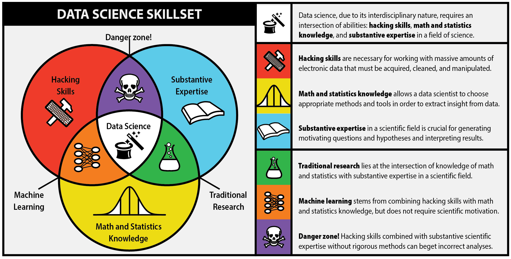
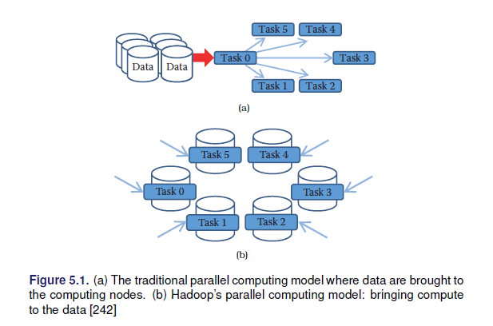
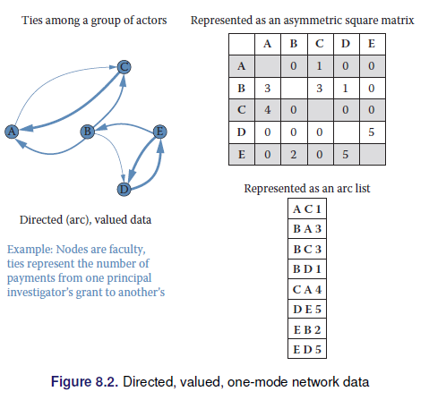
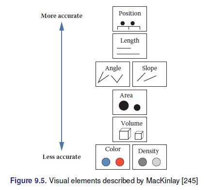

--- 
title: "Big Data en R"
subtitle: "EST-383"
author: "Alvaro Chirino Gutierrez"
description: "Este libro esta destinado a la materia de Programación Estadística I de la carrera de Estadística de la Universidad Mayor de San Andres."
date: "`r Sys.Date()`"
site: bookdown::bookdown_site
output: bookdown::gitbook
documentclass: book
graphics: yes
github-repo: alvarolimber/EST-383
bibliography: book.bib
nocite: '@*'
pandoc_args: ["-Fpandoc-crossref"]
---
# Prefacio {-}

```{r fig.align='center', echo=FALSE, include=identical(knitr:::pandoc_to(), 'html'), fig.link='https://www.crcpress.com/product/isbn/9781138700109'}
knitr::include_graphics('images/cover.png', dpi = NA)
```


<a rel="license" href="http://creativecommons.org/licenses/by-nc-sa/4.0/"></a><br />Este documento de [Alvaro Chirino](https://twiiter/alvarochirinog) esta bajo la licencia de <a rel="license" href="http://creativecommons.org/licenses/by-nc-sa/4.0/">Creative Commons Attribution-NonCommercial-ShareAlike 4.0 International License</a>.

## Audiencia  {-}

El libro fue diseñado originalmente para los estudiantes de la materia de Programación Estadística I, una materia optativa del pregrado de la carrera de Estadística de la Universidad Mayor de San Andres.

Este documento representa un primer acercamiento a los estudiantes de estadistica  al software R y al mundo del Big Data.

## Estructura del libro  {-}

El libro inluye 5 capitulos, estos son:

1. Introducción a R
2. Scraping Web en R
3. Introducción al Big Data
4. Big Data en R
5. R y Spark

## Software y acuerdos {-}

```{r}
sessionInfo()
```

## Bases de datos {-}

En este documento se emplearan 4 bases de datos del contecto Boliviano:

1. Encuesta a Hogares 2019 y 2019. Vivienda y Personas
2. Encuesta de Demografía y Salud 1989 - 2008
3. Encuesta de Niños, niñas y adolescentes 2016
4. Computo oficial de las elecciones del 20 de Octubre de 2019
5. Bases de datos de contagios, muertes y recuperados del COVID-19 del Johns Hopkins Institute.

Estas bases de datos se encuentran disponibles en formato $.RData$ en el repositorio de Github del texto.

## Agradecimiento  {-}

Eponine...

<!--chapter:end:index.Rmd-->

---
bibliography: book.bib
nocite: '@*'
editor_options: 
  chunk_output_type: console
---
# Introducción a R {#introR}

> R es un software de libre distribución

## ¿Qué es R?



### Algo de historia de R

  * R es el hermano de S
  * S es un lenguaje de programación estadística desarrollado por John Chambers de Bell Labs
  * El objetivo de S era “convertir las ideas en el software, de forma rápida y fielmente”
  * S fue creado en 1976 y se reinvento 1988 introduciendo muchos cambios
  * En 1993, StatSci (fabricante de S-Plus) adquieren licencia exclusiva a S
  * S-Plus integra S con una interfaz gráfica de usuario agradable y pleno apoyo al cliente
  * R Fue creado por Ross Ihaka y Robert Gentleman de la University of Auckland, New Zealand

### Acerca de R

  * El proyecto R inicio en 1991
  * R apareció por primera vez en 1996 como un software de código abierto!
  * Altamente personalizable a través de paquetes
  * La comunidad R, se basa en el poder de la colaboración con miles de paquetes de libre disposición
  * Existen muchas interfaces gráficas de usuario de R libres y comerciales (por ejemplo R Studio y Revolución)

### ¿Qué es R?

R es un conjunto integrado de servicios de software para la manipulación de datos, cálculo y representación gráfica. Incluye:

  * instalación sencilla y un fácil almacenamiento de datos
  * un conjunto de operadores para los cálculos en arrays, particularmente en las matrices
  * facilidad en los gráficos y el análisis de datos y
  * bien desarrollado, lenguaje de programación sencillo y eficaz que incluye condicionales, bucles, funciones recursivas definidos por el usuario.
  * Altamente intuitivo


> A pesar de ser libre y de código abierto, R es ampliamente utilizado por los analistas de datos dentro de las empresas y el mundo académico. (R en the NY Times)

Ver [NY Times](https://www.nytimes.com/2009/01/07/technology/business-computing/07program.html?pagewanted=all&_r=0) artículo.

### Algunas referencias

  * aRrgh: a newcomer's (angry) guide to R by Tim Smith and Kevin Ushey
  * Introductory Statistics with by Peter Dalgaard
  * R tarjeta de comandos http://cran.r-project.org/doc/contrib/Short-refcard.pdf
  * Tutorial de R http://www.cyclismo.org/tutorial/R/
  * R project and Bioconductor

Mas avanzado:

  * Hadley Wickham's book

### RStudio

RStudio es un ambiente libre y abierto de desarrollo de código integrado.

  * multiplataforma
  * El resaltado de sintaxis, completado de código, y la sangría inteligente
  * gestionar fácilmente múltiples directorios de trabajo
  * Flexible para el manejo de gráficos
  * Integrado con Knitr
  * Integrado con Git
  
### Instalación

  * R-CRAN https://cran.r-project.org/ (elija el Sistema operativo, descargue y siguiente, siguiente…)
  * R-Studio https://www.rstudio.com/ (elija el Sistema operativo, descargue y siguiente, siguiente…)
  
Nota: Para actualizar ambos paquetes: descargue la nueva versión e instale (las librerías no sufren cambios).

## R Markdown 

**"R Markdown"** se introdujo por primera vez en el paquete knitr a principios de 2012. La idea era incrustar fragmentos de código (de R u otros) en los documentos de Markdown. De hecho, knitr soportó varios lenguajes de autoría desde el principio además de Markdown, incluidos LaTeX, HTML, AsciiDoc, reStructuredText y Textile.

Markdown se ha convertido en el formato de documento más popular. La simplicidad de Markdown se destaca claramente entre estos formatos de documentos.

### Instalación

```{r,eval=F}
install.packages('rmarkdown')

# Si se prefiere la versión en desarrollo
if (!requireNamespace("devtools"))
  install.packages('devtools')
devtools::install_github('rstudio/rmarkdown')
```

Si el objetivo es usar Markdown para generar documentos PDF se necesita instalar Latex.

Existen cheatsheets utiles para usar markdown, como: [cheatsheets](https://github.com/rstudio/cheatsheets/raw/master/rmarkdown-2.0.pdf)

### YAML Header
Al inicio del archivo y entre las lineas ---

```{r,eval=FALSE}
---
title: Mi documento
author: Juan Perez
date: Marzo 22, 20220
output: html_document
---
```


### Sintaxis básica

Énfasis sobre el texto,
```{r,eval=FALSE}
*italic*   **bold**
_italic_   __bold__
```

Secciones, 

```{r,eval=FALSE}
# Header 1
## Header 2
### Header 3
```

Items (viñetas) no ordenadas y ordenadas,

```{r,eval=FALSE}
* Item 1
* Item 2
    + Item 2a
    + Item 2b

1. Item 1
2. Item 2
3. Item 3
    + Item 3a
    + Item 3b
```

Palabras clave con referencias web,

```{r,eval=FALSE}
[linked phrase](http://example.com)
```

Imágenes simples o con titulo,

```{r,eval=FALSE}


```

Blockquotes

> It's always better to give than to receive.

```{r,eval=FALSE}
A friend once said:

> It's always better to give than to receive.
```

Ecuaciones en linea y en párrafo,

En linea $\sum_i{x^2}$ o en párrafo:

$$\sum_i{x^2}$$

```{r,eval=FALSE}
$equation$

$$ equation $$
```

### Tipos de documentos

* beamer_presentation
* github_document
* html_document
* ioslides_presentation
* latex_document
* md_document
* odt_document
* pdf_document
* powerpoint_presentation
* rtf_document
* slidy_presentation
* word_document

### Chunks

Los chunks son entornos que permiten incluir código en R dentro de las distintos tipos de documentos que genera Rmarkdown, los chunks inician con ````  ```{r} y termina con ``` ````, también es posible introducir chunks en linea con el texto, esto se logra introduciendo 

```{r,eval=F}
Texto ... `r <code>` ... texto
```

La parte {r} del chunk sirve para introducir las distintas opciones que va a contener ese chunk, las opciones disponibles son:

  * echo (default = TRUE), muestra el código del chunk en la salida del documento
  * eval (default = TRUE), corre el código del chunk
  * message (default = TRUE), muestra los mensajes que genera el chunk

Existen funciones útiles para mejorar las salidas de tablas, tales como xtable y kable de la librería knitr.

## R básico

R es una calculadora demasiado grande

```{r}
123+456
4657*89
12/34
2443-3434
```

### Lógica de los comandos en R

Como entiende R los comandos

 > comando(argumentos, argumentos, ...)

Advertencia:

  * No es posible resumir un comando
  * R distingue mayúscula de minúscula
  * Siempre cerrar los paréntesis
  * R entiende el orden de los argumentos o su nombre clave

Comando para pedir ayuda

```{r,eval=F}
?mean # comando para pedir ayuda
?lm
```

Escribir varios comandos en una sola línea.

```{r}
123*56 ; 435+3544 ; 454+56
#este es un comentario
1+4;78+89
```


### Palabras reservadas y simbolos especiales de R

  * NA: datos perdidos
  * NULL: datos nulos
  * Inf -Inf: Infinito
  * #: comentario en el código
  * TRUE (T), FALSE (F): valores lógicos
  * NaN: not a number
  * ?: Ayuda
  * x, ,x + y, x - y ,x * y ,x / y ,x ^ y (**),x %% y (mod) ,x %/% y (div int)
  * ! x, .x & y ,x && y ,x | y ,x || y
  * >, <, >=, <=
  
### Símbolos Lógicos

```{r}
!(5>6) # negación
2^2 == 4 # igualdad
2^2 != 4 # desigualdad
(5>6) & (2^2==4) # y lógico
(5>6) | (2^2==4) # ó lógico

(5>6) && (2^2==4) # y lógico
(5>6) || (2^2==4) # ó lógico

5 >= 5
5 <= 5
```

### Asignación o creación de objetos (estructuras, variables)


```{r}
x<-5
y=10
15->z
x1<<-20
x2<-"Hola"
x3<-'hola'
z*y^x
x1+z
x4<-(4>5)
x5<-(y>x^2)
```

Trate de usar nombres significativos! Miren esto:

[Hadley Wickham's book](http://adv-r.had.co.nz/)
[Naming](https://guiquanz.gitbooks.io/google-cc-style-guide/content/ebook/Naming.html)

### Clases en R

```{r}
y1<-50
y2<-"hola"
y3<-(56>60)
y4<-NA  
y5<-NULL

class(y1)
class(y2)
class(y3)
class(y4)
class(y5)

typeof(y1)
typeof(y2)
typeof(y3)
typeof(y4)
typeof(y5)

z<-"12314234"
class(z)
z2<-as.numeric(z)
class(z2)
# as.character
```

### Algunas comandos adicionales

```{r}
rm(y) # eliminar objetos
rm(y1,y2,y3,y4)

# listando los objetos en memoria
ls()
# remover todos los objetos en memoria
rm(list=ls())
```


## Tipos de estructuras

### Homogéneas

* Scalar: un único valor

```{r}
x<-1
y<-"hola"
i<-TRUE
j<-FALSE
w<-F
```

* Vectores: Colección de valores simples. Los vectores en R son vectores columna  

```{r}
# definición
x1<-c(2,4,6)
x2<-c(1,2,3,4,7,9,4,2)
x3<-c("hola","chau","adios","hola")
x4<-c(T,T,T,F,F,F,F,T,F,T,F,F,F)
x5<-c(1,2,3,T,T,"Hola")
x6<-c(1,2,3,T,T,F,F)
# operaciones con vectores
x1+x1
x1+x2 # mal ejemplo
x1**2
x1/x1
x2>5

log(x2) # logaritmo
exp(x2) # exponencial
sqrt(x2) # raíz cuadrada

2^x2
2/x1
# generando vectores
v1<-1:10
v2<-1:10000
sum(v2) #sumar
v3<-100:1
v4<-99:0

v5<-seq(1,100,2)
v6<-seq(0,1,0.01)
seq(by=10,to=100,from=-20)# anotando el nombre de los argumentos
seq(-20,100,10) # respetando el orden de los argumentos

v7<-rep(1,100) # repetir algo 
v8<-rep(c(1,2,3),10)
v9<-rep(c("hola","cómo","estas","?"),10)
length(v8) # conocer el tamaño del vector
length(v6) # conocer el tamaño del vector
# vectores estadísticos, generación de variables aleatorias
set.seed(1234)
x<-runif(100,10,20)
mean(x)
x
z<-round(x,10)
y<-rnorm(100000,10,5)
hist(y)
```

* Matrices

```{r}
A<-matrix(c(1,2,3,4),2,2)
matrix(c(1,2,3,4),2,2,byrow=T)
B<-A>=2
B
matrix(c("Hola","como", "estan","chau"),2,2)
matrix(c("Hola",1,2,3),2,2)
matrix(1:10,2,5)
matrix(1:10,5,2)
matrix(1:10,5,5)
# funciones para crear otras matrices
diag(1,5,5)
diag(1:5,5,5)
# Matriz inversa
C<-matrix(c(2,5,3,7),2,2)
solve(C)
det(C)
# operaciones con matrices
A+C
A-C
A*C # elemento a elemento
A %*% C # Multiplicación matricial
t(C)# transpuesta
D<-C %*% t(C)     # Simétrica
C %*% solve(C) # Inversa
# Desc. Matriz
eigen(D)
svd(D)
qr(D)
dim(D)
```

* Arrays (Generalización)

```{r}
array(1:27,c(3,3,3))
array(1:81,c(3,3,3,3))
```


### Heterogéneas

Estas estructuras permiten el uso de diferentes tipos de clases u objetos.

* Dataframes (Bases de datos)

Tiene una estructura similar a una matriz, donde se define que las filas corresponden a observaciones/sujetos y las columnas son variables.

```{r}
#encuesta en la sala de clases
id<-1:8
name<-c("adriana","anahi","miguel","rayner","rebeca","sergio","vania","yoselin")
mujer<-c(1,1,0,0,1,0,1,1)
bd<-data.frame(id,name,mujer)
bd
dim(bd)
str(bd)# estructura del objeto
# incorporando variables
bd$edad<-round(runif(8,19,25),0)
bd
```

* Listas
Las listas en R son de los objetos más poderosos que tiene, ya que permite almacenar todo.

```{r}
w1<-list(bd,bd,C,1:10000,"Hola",1:10^6)
w1
str(w1)
object.size(w1)/10^6

w2<-list(w1,w1,list(w1,C),C,1:1000) # R puede encapsular objetos de tipo
str(w2)
object.size(w2)/10^6
```

## Indexación
Es el proceso de manejar los elementos dentro de los objetos.

```{r}
#VECTORES
x<-1:100
x[c(1,5,7)]
x[-c(1,5,7)]
o<-(x %% 2)==0
x[o]
x2<-c(2,3,7,4)
x2[c(T,T,F,F)]
#matrices
A<-matrix(1:30,5,6)
A[ 3, 4]
A[3, ]
A[c(1,4), ]

A[,1:2 ]
A[,-c(1:2) ]
A[3:4,c(1,3)]
A[c(T,T,F,T,T),c(T,F,T,T,T,F)]
#data frame
bd[1:3,2:3]
# también es posible usar el nombre de las variables 
bd[1:6,c("name","id")]
bd[,-c(3)]
bd$mujer
mean(bd$mujer)
bd[c(2,6,8),]
bd[bd$edad<=21 & bd$mujer==1,]
#bd %>% filter(mujer==1 & edad<=21)
```

## Loops y condiciones

```{r,eval=F}
rm(list = ls())
x<-5
## if
if(x>6){
  hist(rnorm(100,3,2))
}
## if else
if(x>6){
  hist(rnorm(100,3,2))
} else {
  boxplot(rnorm(100,3,2))
}
## if encadenado
x<-60
if(x>6){
  hist(rnorm(100,3,2))
  mean(x)
} else if(x<6){
  boxplot(rnorm(100,3,2))
} else if(typeof(x)=="double"){
  print("hola")
} else {
  print("hola hola")
}
##for
for(i in 1:100){
  print(i)
}
for(i in c(2,7,9,15,19)){
  print(i)
}  
for(i in c("a","b","c")){
  print(i)
}  
for(i in 1:5){
  for(j in 6:10){
    print(i*j)
  }
}
for(i in 1:5){
  for(j in 6:10){
    aux<-i*j
    print(aux)
    if(aux==20){
      break()
      print("hola")
      boxplot(rnorm(100,i,j))
    }
  }
}

for(i in 1:50){
  print(i)
  if(i==20){
    break()
  }
}

#while
z<-1
k<-1
while(z>0.0001){
  print(k)
  z<-1/k
  k<-k+1
}
z==0.0001
```

## Crear funciones en R.

Una función en R tiene la misma idea de lo que realiza una función en cálculo $f(x)=y$, $f(x)=x^2=y$, $f(x,y)=.()$.

Estructura básica de una función en R.
  
  * El nombre de la función ($f$)
  * Los argumentos $X,Y,\ldots$
  * Los procedimientos dentro de la función
  * Las salidas $y$
  
```{r,eval=F}
nombrefuncion<-function(x){
  print("Hola")#procedimiento 1
  y<-x^2 #procedimiento 2
  return(y)
}
nombrefuncion(x=2)
nombrefuncion(x=2:10)

x2<-nombrefuncion(x=1:100)
x2
x3<-nombrefuncion(2:5)
x3
###### funciones matemáticas
ff<-function(x){
  y<-x^2
  return(y)
}
gg<-function(x){
  y<-log(x)
  return(y)
}
hh<-function(x){
  y<-exp(-x^2)
  return(y)
}
curve(ff,xlim=c(-10,10))
curve(gg,xlim=c(0,100))
curve(hh,xlim=c(-10,10))
```

Ejemplo, desarrolle una función que dado un vector numérico de valores enteros, devuelva;

  * La suma de los números pares
  * La suma del vector
  * Coeficiente de variación del vector
  
```{r,eval=F}
tarea1<-function(x){
  s1<-sum(x[x %% 2 ==0])
  s2<-sum(x)
  s3<-sd(x)/mean(x)
  return(list(suma_pares=s1,suma=s2,cv=s3))
}
tarea1(1:10)
####################################################
tarea1_alt<-function(x){
  return(list(suma_pares=sum(x[x %% 2 ==0]),suma=sum(x),cv=sd(x)/mean(x)))
}
tarea1_alt(1:10)
tarea1(rnorm(100))

x<-1:10
sum(1:10)
cumsum(1:10)
tail(cumsum(1:10),1)

# el comando scan permite leer los datos directamente por la consola
xx<-scan()
tarea1(xx)
```

Otros ejemplos,  

```{r,eval=F}
fx<-function(x){
  y<-8*x**2
  return(y)
}
fx(5)
fx(1:10)
curve(fx,xlim = c(-20,20),ylim=c(0,1000))
plot(fx)
##comando de estadísticas de tendencia central
tendencia<-function(x){
  n<-length(x)
  cat("media:",fill = T)
  print(sum(x)/n)
  cat("mediana:",fill = T)
  x<-sort(x)
  if(n%%2==0){
    me<-(x[n/2]+x[n/2+1])/2
  } else {
    me<-x[ceiling(n/2)]
  }
  print(me)
  cat("moda:",fill = T)
  tt<-table(x)
  mm<-max(tt)
  print(names(tt)[(table(x)==mm)])
  cat("media cuadrática:",fill = T)
  mc<-sqrt(sum(x**2)/n)
  print(mc)
  cat("media armónica",fill = T)
  ma<-n/sum(1/x)
  print(ma)
  cat("media geométrica:",fill = T)
  mg<-prod(x)**(1/n)
  print(mg)
}

tendencia2<-function(x){
  n<-length(x)
  media<-sum(x)/n
  x<-sort(x)
  if(n%%2==0){
    me<-(x[n/2]+x[n/2+1])/2
  } else {
    me<-x[ceiling(n/2)]
  }
  tt<-table(x)
  mm<-max(tt)
  mo<-names(tt)[(table(x)==mm)]
  mc<-sqrt(sum(x**2)/n)
  ma<-n/sum(1/x)
  mg<-prod(x)**(1/n)
  aux<-list(media,me,mo,mc,ma,mg)
  return(aux)
}
a<-tendencia2(xx)

tendenciaF<-function(x,f){
  n<-sum(f)
  media<-sum(x*f)/n
}
```

## Importación de datos

  * Definir el directorio de trabajo
  * Identificar el formato de la base de datos que se va a importar
  * Usar el comando adecuado para la importación

```{r,eval=F}
#gestión de directorios del R
getwd() # indica el directorio de trabajo actual
dir() # lista los archivos en el directorio de trabajo
setwd("C:/Users\\ALVARO\\Desktop\\ejemplo") # cambiar el directorio de trabajo
# Cargar la base de datos, depende del formato de la base de datos
mun15<-read.csv("municipales2015.csv")
#trabajar con librerías
library(foreign) #habilitar una librería
bd12pv<-read.dta("DBvivienda2012vf_9.dta")
```

## Exportar la base de datos

```{r,eval=F}
write.csv(bd12pv,"bd12pv.csv") # a otros formatos
save(mun15,bd12pv,file="bases.RData") # al formato .RData
```

Para abrir un objeto RData

```{r,eval=F}
rm(list=ls())
load("bases.RData")
load(url("https://github.com/AlvaroLimber/EST-383/raw/master/data/eh19.RData"))
```

Actividad Martes.
  * Indagar el github
  * Crearse una cuenta
  * Crear un repositorio para sus proyectos
  * Crear un repositorio para sus ejercicios
  * Instalar el github desktop
  * Interactuar con sus repositorios
  * Poner en el tablón del classroom su nombre de usuario del classroom o enlace

> Instalando librerías en R

```{r,eval=F}
#install.packages("dplyr")
#install.packages("rlang")
library(dplyr) #gramática de manejo de bases de datos 
```


## Dataframe y exploración

```{r,eval=F}
rm(list=ls())
#encuestas a hogares 2019
load(url("https://github.com/AlvaroLimber/EST-383/raw/master/data/eh19.RData"))
#computo La Paz 2021, 9 marzo
setwd("C:\\Users\\ALVARO\\Desktop\\_data\\bigdata")
bd<-read.csv("lp_2021.csv",sep="|",header = T)
# exploración
names(bd)
names(eh19v)

attributes(bd)
ehvat<-attributes(eh19v)

head(bd)
tail(bd)
View(bd)

View(eh19p)
# Renombrando variables
# R base
names(eh19p)[5]<-"sexo"
# dplyr "anidar acciones" pipeline %>% 
eh19p<-eh19p %>% rename(edad=s02a_03) 

# Filtrar bases de datos (filas)
## filtrar por tipo de elección en bd
aux<-unique(bd$DESCRIPCION)
bdgob<-bd[bd$DESCRIPCION=="GOBERNADOR(A)" , ] # R base
bdast<-subset(bd,DESCRIPCION=="ASAMBLEISTA TERRITORIO") # R base

bdasp<-bd %>% filter(DESCRIPCION=="ASAMBLEISTA POBLACION") # dplyr
bdalc<-bd %>% filter(DESCRIPCION==aux[4])
bdcon<-bd %>% filter(DESCRIPCION==aux[5])
## filtrar solo a jefes/as del hogar eh19
#tarea ...
 
# Seleccionar variables (columnas)
## R base
aux2<-eh19p[,c("edad","sexo")]
aux3<-subset(eh19p,select = c("edad","sexo") )
aux4<-eh19p[,-c(4:50,100)]
## dplyr
aux5<-eh19p %>% select(edad,sexo)
aux6<-eh19p %>% select(-edad,-sexo)
```

Otros comandos útiles son los que permiten añadir información

  * Añadir filas: rbind (R base) bind_rows, tratar de garantizar que las bases de datos tengan los mismos nombres de variables
  
```{r,eval=F}
bdmun<-rbind(bdalc,bdcon)
bdmun2<-bind_rows(bdalc,bdcon)
```

  * Añadir columnas (variables): merge (R base) bind_cols (dplyr), asegurarse que ambas bases de datos tengan una variables de unión (key)
  
```{r,eval=F}
bdpv<-merge(eh19p[,c("edad","folio","sexo")],eh19v[,c("folio","s01a_10")],"folio")
View(bdpv)
```

Tarea: Para la encuesta a hogares 2019, generar una base de datos de jefas/jefas que incluya:

  * Información demográfica (edad, sexo, estado civil, lugar de nacimiento)
  * Información geográfica (departamento, área)
  * Educación  (Nivel educativo, años de educación)
  * Condiciones de su vivienda (techo, piso, pared, agua, alcantarillado)
  * Pobreza moderada y extrema
  
Generar un reporte por departamento y sexo del jefe del hogar respecto su condición de pobreza extrema.

```{r}
rm(list=ls())
library(dplyr)
load(url("https://github.com/AlvaroLimber/EST-383/raw/master/data/eh19.RData"))
#jefe/jefa
aux<-unique(eh19p$s02a_05)
bdj<-eh19p %>% filter(s02a_05==aux[1])
#selección de variables para el/la jefa/jefa 
bdj<-bdj %>% select(folio,depto,area,s02a_02,s02a_03,s02a_10,p0, pext0, niv_ed, niv_ed_g, aestudio)
#selección de variables para la vivienda
bdv<-eh19v %>% select(folio,s01a_06,s01a_08,s01a_09,s01a_10,s01a_15,s01a_16)
# unir las bases de datos, 
bdj<-merge(bdj,bdv,"folio")
```


## Estadística descriptiva

```{r,eval= F}
##tablas de frecuencias y Porcentajes
t1<-table(bdj$depto)# frecuencias
t2<-prop.table(t1)*100
t3<-cumsum(t1)

tabla1<-cbind(t1,t3,t2)
tabla1
barplot(t1)
pie(t2)
#tabla de contingencia
t4<-table(bdj$depto,bdj$s02a_02)
t5<-prop.table(t4)#celda
sum(t5)
t6<-prop.table(t4,1)*100#fila
t7<-prop.table(t4,2)*100#columna
t8<-addmargins(t4)
addmargins(t4,1)
addmargins(t4,2)
colnames(t8)[3]<-"Total"
row.names(t8)[10]<-"Total"
install.packages("xtable")
library(xtable)
xtable(t8)
library(knitr)
kable(t8)

table(bdj$depto,bdj$area,bdj$s02a_02)

chisq.test(t4)# tarea: recordar
chisq.test(table(bdj$niv_ed_g,bdj$s02a_02))
##medidas de tendencia central
mean(bdj$s02a_03)
median(bdj$s02a_03)
#media y mediana de edad por departamento y sexo
bdj %>% group_by(Departamento=depto,sexo=s02a_02) %>% summarise(media=mean(s02a_03),Me=median(s02a_03))

#tip ctr+shift+m %>% 

#medidas de dispersión
var(bdj$s02a_03) 
sd(bdj$s02a_03)
range(bdj$s02a_03)
min(bdj$s02a_03)
max(bdj$s02a_03)
bdj %>% group_by(Departamento=depto,sexo=s02a_02) %>% summarise(media=mean(s02a_03),Me=median(s02a_03),sd_media=sd(s02a_03))
boxplot(bdj$s02a_03)
#medidas de forma
quantile(bdj$s02a_03)
quantile(bdj$s02a_03,c(0.15,0.45,0.99))
quantile(bdj$s02a_03,seq(0,1,0.01))
quantile(bdj$s02a_03,seq(0,1,0.2))
#Coeficiente de asimetría-> averiguar
#kurtosis...
hist(bdj$s02a_03)
plot(density(bdj$s02a_03))

plot(density(rnorm(10000,0,3)),ylim=c(0,0.25))
points(density(rnorm(10000,0,1.5)),col="red",type="l")
points(density(rnorm(10000,0,6)),col="green",type="l")

summary(bdj$s02a_03)
bdj$edadg<-cut(bdj$s02a_03,c(15,25,50,98))
table(bdj$edadg)
mean(bdj$s02a_03)
```

## Inferencia en R

Esta orientada a generar el análisis a partir de una muestra probabilística, reconociendo los insumos básicos para esto. Recordar al estimador de Horvitz Thompson para el parámetro del total:

$$\hat{t}_y=\sum_s \frac{ y_k}{\pi_k}=\sum_s y_k*\frac{1}{\pi_k}=\sum_s y_k*w_k$$

Donde $\pi_k$ es la probabilidad de selección del individuo $k$ y $w_k=\pi_k^{-1}$ se conoce como el factor de expansión.

$$\bar{y}_s=\frac{\hat{t_y}}{N}$$

Todo estimador tiene su varianza teórica $V(\hat{\theta})$ y su estimación de la varianza ($\hat{V}(\hat{\theta})$). Estas varianza depende del método de muestreo empleado, las características mas importantes para construir (aproximar) la varianza en muestreos complejos; la conglomeración y estratificación de la primera etapa.


```{r,eval=F}
####Inferencia a partir de una muestra
#librería survey
install.packages("survey")
install.packages("srvyr")#trabaja con dplyr
library(survey)
load(url("https://github.com/AlvaroLimber/EST-383/raw/master/data/eh19.RData"))

mean(eh19p$s02a_03) # media a nivel de la muestra
#definir el diseño muestral
sd1<-svydesign(ids= ~upm ,strata = ~estrato,weights = ~factor,data=eh19p)
r1<-svymean(~s02a_03,design = sd1,deff=T)
r1
confint(r1)
cv(r1)
deff(r1)
#pobreza
prop.table(table(eh19p$p0))*100
svymean(~p0,design = sd1,deff=T,na.rm=T)*100
```
nota: los valores perdidos en R se denotan por $NA$

```{r,eval=F}
x<-c(23,45,64,22,NA,NA,78,54)
mean(x,na.rm=T)
mean(na.omit(x))

table(is.na(eh19p$p0))
#modelos lineales
lm(ylab~aestudio,data=eh19p)
svyglm(ylab~aestudio,design = sd1)
```

## Gráficos de origen

```{r,eval=F}
rm(list=ls())
################
plot(0,0)#inicia una hoja en blanco
plot(0,0,type = "n")

x<-c(3,4,7,2)
y<-c(0,6,9,2)
plot(x,y,type="p")

plot(x,y,type="h")
plot(x,y,type="l")
x[order(x)]

plot(x[order(x)],y[order(x)],type="l")
plot(x,y,type = "b")
plot(x,y,type = "o")
#ventanas multiples
par(mfrow=c(2,2))
plot(0,0,type = "n")
plot(x,y,type="p")
plot(x,y,type="h")
plot(x,y,type = "b")
dev.off()#desactivando el par

#limites para el plot
plot(x,y,xlim=c(0,10),ylim=c(0,10))
#título
plot(x,y,xlim=c(0,10),ylim=c(0,10),main="Nombre de la figura")
#sin ejes
plot(x,y,xlim=c(0,10),ylim=c(0,10),main="Nombre de la figura",axes=F)
#sin ejes y etiquetas de los ejes
plot(x,y,xlim=c(0,10),ylim=c(0,10),axes=F,ann=F)
#tipo de la salida del punto
plot(x,y,xlim=c(0,10),ylim=c(0,10),axes=F,ann=F,pch=15)
#tamaño de los puntos
plot(x,y,xlim=c(0,10),ylim=c(0,10),axes=F,ann=F,pch=15,cex=4)
#Color de los puntos
plot(x,y,xlim=c(0,10),ylim=c(0,10),axes=F,ann=F,pch=15,cex=4,col="darkgreen")
#definir, formas, tamaños y colores para cada punto.
plot(x,y,xlim=c(0,10),ylim=c(0,10),axes=F,ann=F,pch=c(4,5,15,6),cex=c(1,2,3,4),col=c("red","gray","green","blue"))
#con lwd se puede dar mayor grosor a las líneas

pdf("f1.pdf",height = 5,width = 10)
plot(x,y,xlim=c(0,10),ylim=c(0,10),axes=F,ann=F,pch=c(4,5,15,6),cex=c(1,2,3,4),col=c("red","gray","green","blue"),lwd=4,type = "p")
points(x,y,type="h")
points(2,8,col="red",pch=14)
text(5,7,"Hola")
axis(1,c(0,5,10))
axis(2,c(0,5,10),c("A","B","C"))
dev.off()
#png
#jpeg
```

## ggplot

The grammar of graphics is an answer to a question: what is a statistical graphic? 

  + base graphics 1983
  + grid 2000
  + lattice 1993
  + ggplot 2005
  + ggvis 2014
  + plotly 

### Datos, estetica y geometria (layers)

```{r,eval=F}
rm(list=ls())
#install.packages("ggplot2")
#install.packages("dplyr")
#install.packages("maps")
#install.packages("ggvis")
library(ggplot2)
library(dplyr)
library(maps)
library(ggvis)
library(readxl)
#######################################
load(url("https://github.com/AlvaroLimber/EST-383/raw/master/data/eh19.RData"))
set.seed(1424)
s<-sample(1:39605,2000)
bd<-eh19p[s,]

# una variable
ggplot(bd,aes(s02a_03))+geom_histogram()
ggplot(bd,aes(s02a_03))+geom_boxplot()
ggplot(bd,aes(s02a_03))+geom_density()

#2 variables cuantitativas
ggplot(bd,aes(s02a_03,ylab))+geom_point()
# 3 variables
ggplot(bd,aes(s02a_03,log(ylab),shape=s02a_02))+geom_point()
ggplot(bd,aes(aestudio,log(ylab),shape=s02a_02))+geom_point()
#4variables
ggplot(bd,aes(s02a_03,log(ylab),shape=s02a_02,colour=area))+geom_point()
#5variables
ggplot(bd,aes(s02a_03,log(ylab),shape=s02a_02,colour=area,size=ynolab))+geom_point()+geom_smooth()

ggplot(bd,aes(s02a_03,log(ylab)))+geom_point()+geom_smooth(method = "lm")#introducir un ajuste lineal
#6variables
ggplot(bd,aes(s02a_03,log(ylab),shape=s02a_02,colour=area,size=ynolab))+geom_point()+facet_wrap(~depto)
#7 variables
ggplot(bd,aes(s02a_03,log(ylab),shape=s02a_02,colour=area,size=ynolab))+geom_point()+facet_wrap(~depto+p0)

#2 variables 1 cuanti cuali
ggplot(bd,aes(ylab,area))+geom_boxplot()
ggplot(bd,aes(area,ylab))+geom_boxplot()
ggplot(bd,aes(area,ylab))+geom_violin()
ggplot(bd,aes(area,ylab))+geom_violin()+facet_wrap(~depto)
ggplot(bd,aes(depto,log(ylab)))+geom_violin()+facet_wrap(~area)
ggplot(bd,aes(area,ylab))+geom_jitter()


ggplot(mpg, aes(x = displ, y = hwy)) + 
  geom_area()

# 1 variable cualitativa
ggplot(bd,aes(depto))+geom_bar(colour="blue",fill="red",alpha=0.1)
#Etiquetas
g1<-ggplot(bd,aes(depto))+geom_bar(colour="blue",fill="red",alpha=0.1)+ggtitle("Departamentos")+xlab("Departamento")

g1+ylab("Frecuencia")+ylim(0,1000)

#guardar 
pdf("g1.pdf")
g1+ylab("Frecuencia")+ylim(0,1000)
dev.off()
#temas 
ggplot(bd,aes(depto))+geom_bar()+theme_gray()
ggplot(bd,aes(depto))+geom_bar()+theme_bw()
ggplot(bd,aes(depto))+geom_bar()+theme_dark()
ggplot(bd,aes(depto))+geom_bar()+theme_minimal()
ggplot(bd,aes(depto))+geom_bar()+theme_light()
ggplot(bd,aes(depto))+geom_bar()+theme_void()
ggplot(bd,aes(depto))+geom_bar()+theme_classic()
#temas
theme_bw()
theme_grey()
theme_linedraw()
theme_light()
theme_dark()
theme_minimal()
theme_classic()
theme_void()
```

## Flexdashboard

Es una librería de R que permite crear tableros de datos (dashboard), la salida final esta diseñada para un entorno web (html). 

```{r,eval=F}
install.packages("flexdashboard")
library(flexdashboard)
```

## Shiny 

Shiny es una librería de RStudio orientada a crear aplicaciones web interactivas con R. Una vez instalada existen dos formas de crear una aplicación en Shiny.
Una alternativa cada vez mas popular es la de crear un documento shiny junto con Markdown.

1. Mediante un solo archivo denominando app.R
2. Mediante dos archivos separados, el server.R y ui.R

Se recomienda que en cualquiera de las dos alternativas, estos archivos estén contenidos en alguna carpeta. Existen dos partes esenciales al momento de definir una app en Shiny, el UI que es una función que define la interfaz de la aplicación y el Server que define una función con instrucciones sobre cómo construir y reconstruir los objetos R que se mostraran en la UI. La composición básica según las formas de aplicarlas son:

```{r,eval=FALSE}
# app.R
library(shiny)
ui <- fluidPage(
numericInput(inputId = "n",
"Sample size", value = 25),
plotOutput(outputId = "hist")
)
server <- function(input, output) {
output$hist <- renderPlot({
hist(rnorm(input$n))
})
}
shinyApp(ui = ui, server = server)
```

```{r,eval=F}
# ui.R

fluidPage(
numericInput(inputId = "n",
"Sample size", value = 25),
plotOutput(outputId = "hist")
)

# server.R

function(input, output) {
output$hist <- renderPlot({
hist(rnorm(input$n))
})

```

### UI

Al ser UI la interfaz esta permite la interacción directa con el usuario, a estas se las denominan los entradas $input$, las opciones de *input* son:

* **Botón de acción:** actionButton(inputId, label, icon)
* **Enlace:** actionLink(inputId, label, icon,)
* **Check box múltiple:** checkboxGroupInput(inputId,label, choices, selected, inline)
* **Check box simple:** checkboxInput(inputId, label,value)
* **Fecha:** dateInput(inputId, label, value,min, max, format, startview,weekstart, language)
* **Rango de fecha:** dateRangeInput(inputId, label,start, end, min, max, format,startview, weekstart, language,separator)
* **Cargar archivo:** fileInput(inputId, label, multiple,accept)
* **Entrada numérica:** numericInput(inputId, label, value,min, max, step)
* **Tipo contraseña:** passwordInput(inputId, label,value)
* **Selección tipo botones:** radioButtons(inputId, label,choices, selected, inline)
* **Seleccionable:** selectInput(inputId, label, choices,selected, multiple, selectize,width, size) 
* **Slider:** sliderInput(inputId, label, min,max, value, step, round, format,locale, ticks, animate, * width,sep,pre, post)
* **Enviar** submitButton(text, icon)
* **Entrada de texto** textInput(inputId, label, value)

Los inputs principalmente tienen dos argumentos el **inputId** que se refiere al identificador del input, este se utiliza en el server, y el **label** que es la etiqueta que aparece en la interfaz visual, estos inputs se asignan a algún objeto (xx<-input()). En el server se tiene acceso al input mediante input$xx.

### Server

En cuanto el server, este usa los distintos inputs para generar las salidas (outputs), las opciones de salidas disponibles son:

* DT::renderDataTable(expr, options,callback, escape, env, quoted)
* renderImage(expr, env, quoted,deleteFile)
* renderPlot(expr, width, height, res, …,env, quoted, func)
* renderPrint(expr, env, quoted, func,width)
* renderTable(expr,…, env, quoted, func)
* renderText(expr, env, quoted, func)
* renderUI(expr, env, quoted, func)

Estos outputs "render" se asignan a un objeto y luego ellos deben ser incluidos dentro del UI con su correspondiente Output:

* dataTableOutput(outputId, icon, …)
* imageOutput(outputId, width, height,click, dblclick, hover, hoverDelay, inline,hoverDelayType, brush, clickId,hoverId)
* plotOutput(outputId, width, height, click,dblclick, hover, hoverDelay, inline,hoverDelayType, brush, clickId,hoverId)
* verbatimTextOutput(outputId)
* tableOutput(outputId)
* textOutput(outputId, container, inline)
* uiOutput(outputId, inline, container, …) y htmlOutput(outputId, inline, container, …)

## Ejercicios Propuestos

1. Crear una función que devuelva los $k$ primeros números primos
2. Crear una función que calcule la mediana para tablas de frecuencias con intervalos de clases
3. Crear una función que calcule los Quantiles para tablas de frecuencias con intervalos de clases
4. Realice una función para el calculo del tamaño de muestra para el muestreo aleatorio simple, considere la media, el margen de error relativo y coeficientes de confianza.
5. Crear una función que realice la prueba de independencia Chi-cuadrado 
6. Empleando la ENDSA muestre por año y departamento el porcentaje de personas que fuman
7. Utilizando la base de datos del COVID-19 genere un gráfico de evolución de contagios, muertes y recuperados. Use los gráficos de origen
8. Utilizando la base de datos del COVID-19 genere un gráfico de evolución de contagios, muertes y recuperados. Use ggplot
9. Utilizando la encuesta 2018, genere un reporte que presente:
    * Total de población y viviendas por departamento y área
    * Pobreza moderada por Departamento y área
    * Indice de Gini por departamento
10. Realice una función en Shiny empleando la base de datos electoral del $20o$ que permita ver los resultados por recinto, seleccionando, su país, departamento, municipio, recinto.
11. Usando la EH 2018, determine el porcentaje de personas que sufrieron un Atraco (Robo a personas) en la vía pública en los últimos 12 meses.

<!--chapter:end:1_introR.Rmd-->

# Introducción al Big Data
[comment]: <> (Principalmente de: BIG DATA AND SOCIAL SCIENCE, Jeff Gill)

## Definiendo al Big Data

De forma simple el Big Data se define como:

$$DATA>RAM$$

O de forma mas literal "cualquier cosa demasiado grande para caber en su computadora."

La Asociación Americana de Investigación de Opinión Pública menciona: "El término" Big Data "es una descripción imprecisa de un conjunto rico y complicado de características, prácticas, técnicas, cuestiones éticas y resultados, todos asociados con los datos".

## Las 5 V en el Big Data

* Velocidad
* Volumen
* Valor
* Variedad
* Veracidad

## Ciclo de vida de un proyecto de análisis de datos

Se pueden identificar 4 fases:

1. Clarify: (Clarificar) Llegar a familiarizarse con los datos
2. Develop: (Desarrollar) Crear un modelop de trabajo
3. Productize: (Producir) Automatizar e integrar 
4. Publish: (Publicar) Socializar

Estas fases pueden contener nodos adicionales según el proyecto:

0. Subset: Extraer los datos a explorar, los datos de trabajo
1. Clarify: (Clarificar) Llegar a familiarizarse con los datos
2. Develop: (Desarrollar) Crear un modelop de trabajo
    *. Scale Up: Generalizar a la base de datos completa
3. Productize: (Producir) Automatizar e integrar 
4. Publish: (Publicar) Socializar

Otros ciclos de trabajo puedes ser:

1. Identificar el problema
2. Diseño del requerimiento de datos
3. Procesar los datos
4. Desarrollo del análisis sobre los datos
5. Visualizar los datos

## Inferencia y Big Data

El objetivo de la inferencia es poder decir algo de la población objetivo a partir de la información disponibles. Se debe tener en cuenta los tipos de estudio provenientes; ya sean de encuestas probabilísticas, diseño experimentales o estudios de observación. Se debe estar seguro de la calidad de la base de datos proveniente, ya sean estos los errores de muestreo, procesos de calibración, ponderación, post estratificación en el caso de muestreo o el propensity score y la estratificación principal para reparar diseño experimentales rotos.

Se puede distinguir tres metas en el proceso de inferencia:

* Descriptivo
* Causal
* Predictivo

### Descriptivo
La estadística descriptiva puede ser; (1) a un nivel simple de descripción de una base de datos sin la búsqueda de querer expandir los resultados (registros administrativos, censos, estudios de observación) o (2) para encuestas probabilisticas, realizar las estimaciones de la muestra con sus respectivos errores muestrales y a partir de estas estimaciones describir a la población

> **Ejemplo:** El INE estima a partir de la EH-2018 que la incidencia de pobreza moderadara en Bolivia para el 2018 alcanza el ...%

Ejemplos como este muestra que el propósito es puramente descriptivo en cuanto a la pobreza. 

### Causal
Muchos investigadores buscan explorar hipótesis, aveces originadas en la teoría o en alguna relación observada de forma empírica, con la idea central de permitir la inferencia causal. 

La data para esto proviene de diseños experimentales o fuertes estudios no experimentales (cuasi-experimentales), el interés de estos estudios es principalmente encontrar el efecto de de una variable entre otra. 

$$X \rightarrow Y$$
 Aspecto que es logrado fácilmente mediante los diseños experimentales. En este tipo de estudio el componente descriptivo no es tan importante como el método para identificar la causalidad. Es importante diferenciar en este punto *la causalidad de la correlación*. 
 
> **Ejemplo:** (3ie) Este informe se basa en un estudio de Dupas, Duflo y Kremer que se realizó en colaboración con el gobierno de Ghana. El estudio examinó los impactos a mediano plazo de otorgar becas de cuatro años a estudiantes que no podían matricularse en escuelas secundarias superiores (SHS) debido a limitaciones financieras. Los investigadores encontraron que el programa de becas tuvo un impacto significativo en el logro educativo y las habilidades cognitivas, particularmente entre las niñas. El programa también tuvo un mayor impacto en las tasas de finalización de SHS de las niñas en términos porcentuales.

> **Ejemplo:** UDAPE el 2013 realizó el calculo del impacto de la renta dignidad en Bolivia empleando el método de regresión discontinua un método cuasi-experimental.
 
Una de las debilidades principales de estos estudios es la falta o poca de validez  externa, es decir, es difícil poder generalizar los resultados. 

  * Métodos cuasi-experimentales
    + Diferencia en diferencia
    + Propensity Score Matching (PSM) Probit. 
    + Variables instrumentales
    + Modelos estructurales
    + Regresión Discontinua.

### Predictivo
El pronóstico o predicción tiene un rol diferenciado según la ciencia de aplicación, teniendo un rol significativo dentro de las estadística oficiales, principalmente en lo social (proyecciones poblacionales) y económico (indicadores macroeconómicos), principalmente para hacedores de política, gobernantes y empresarios. Similar a
En la configuración de inferencia causal, es de suma importancia que conozcamos el proceso que generó los datos, y podemos descartar cualquier mecanismo de selección sistemática desconocido o no observado.

> **Ejemplo:** El Institute of Global Health, Faculty of Medicine, University of Geneva tiene una página web que realiza pronosticos por país para los casos de COVID-19.  [Enlace](https://renkulab.shinyapps.io/COVID-19-Epidemic-Forecasting/)

## Calidad de dato y Big Data

La mayoría de los datos en el mundo real son ruidosos, inconsistentes y adolecen de valores perdidos, independientemente de su origen. Incluso si la recopilación de datos es barata, los costos de crear datos de alta calidad a partir de la fuente (limpieza, conservación, estandarización e integración) son considerables. La calidad de los datos se puede caracterizar de múltiples maneras:

* **Precisión:** ¿qué tan precisos son los valores de los atributos en los datos?
* **Integridad:** ¿están completos los datos?
* **Consistencia:** ¿Cuán consistentes son los valores en y entre las bases de datos?
* **Puntualidad:** ¿qué tan oportunos son los datos?
* **Accesibilidad:** ¿están disponibles todas las variables para el análisis?

Los cientistas de datos tienen décadas de experiencia en la transformación de datos desordenados, ruidosos y no estructurados en un conjunto de datos bien definido, claramente estructurado y probado en calidad. El pre procesamiento es un proceso complejo y que lleva mucho tiempo porque es *práctico*: requiere juicio y no puede automatizarse de manera efectiva. Un flujo de trabajo típico comprende múltiples pasos desde la definición de datos hasta el análisis y termina con el filtrado. Es difícil exagerar el valor del pre-procesamiento para cualquier análisis de datos, pero esto es particularmente cierto en big data. Los datos deben analizarse, estandarizarse, no duplicarse y normalizarse.

* **Análisis (parsing):** Exploración de datos
* **Estandarización (Standardization):** Identificar variables que requieren transformación y ajustes.
* **Duplicación:** Consiste en eliminar registros redundantes
* **Normalización (Normalization):** Es el proceso de garantizar que los campos que se comparan entre archivos sean lo más similares posible en el sentido de que podrían haber sido generados por el mismo proceso. Como mínimo, se deben aplicar las mismas reglas de estandarización a ambos archivos.

## Captura y preservación
Se refiere al proceso de obtener la información de las distintas fuentes posibles y luego pasar a un proceso de preservación. 


### Fuentes convencionales
Estas están basadas en la información que se distribuye de forma tradicional mediante bases de datos estructuradas, normalmente estas las distribuyen instituciones con amplios conocimientos en la gestión de bases de datos, para el caso de Bolivia se puede citar algunas: 

* Instituto Nacional de Estadística
* SNIS
* UDAPE
* Geoboliva
* Ministerios ...

### Datos web y APIs

Referirse al capítulo 2 de scraping web, estos son los mecanismos para extraer información en internet

### Record Linkage

Se refiere al proceso de concatenar o unir observaciones dispuestas en múltiples bases de datos.

  * Puede ser usado para compensar la falta de información
  * Se usa para crear estudios longitudinales
  * Se pueden armar seudo-paneles

Esto permite mejorar la cobertura (append), ampliar las temáticas de estudio (merge). 


  * Matching: Une información a partir de una clave, existen muchos problemas con claves tipo texto.
  * Aproximaciones a reglas para hacer math: Definir criterios para posibilitar el match basados en reglas, distancias cercanas, etc.
  * Match basados en probabilidad: Fellegi–Sunter method


### Bases de datos

Una vez que los datos fueron recolectados y enlazados entre diferentes fuentes, es necesario guardar la información. Ahora se discute las alternativas para guardar la información. 

  * DBMS (databasemanagement systems) Sistema de gestión de base de datos: Decidir que herramienta usar segun la dimensión de los archivos.
  

  
  * Bases de datos espaciales
  * Múltiples formatos: https://juliael.carto.com/

### Programando con Big Data

  * MapReduce: map, shuffle y reduce


  * Apache hadoop MapReduce (Hadoop Distributed File System HDFS)
  * Apache Spark
  


## Análisis y modelado

### Machine learning

**¿Machine learning = Statistics?**

Verán que muchos métodos discutidos a lo largo de su formación como estadísticos aparecen dentro del maching learning y que son llamados con otros nombres. 

Al pensar en machine learning debemos asociarlo directamente con procesos computacionales, muchos otros conceptos giran al rededor de esta idea como la inteligencia artificial. Proceso de machine learning hoy:

  * Permiten manejar autos de forma autónoma
  * Puede recomendar libros, amistades, música, etc
  * Identificar drogas, proteínas y ciertos génes
  * Se usa para detectar ciertos tipos de cáncer y otras enfermedades médicas
  * Ayudan a conocer que estudiantes necesitan un apoyo adicional 
  * Ayudan a persuadir por que candidato votar en las elecciones.

#### El proceso del machine learning
  
  * Entender el problema y la meta
  * Formular esto como un problema de machine learning
  * Explorar y preparar los datos
  * Feature engineeing 
  * Selección del método
  * Evaluación
  * Deployment

#### Formulación del problema
En ML existen 2 grandes categorías

  1. Aprendizaje supervisado: Existe una $Y$ que queremos predecir o clasificar a partir de los datos. El fin es el ajuste y la generalización
    * Clasificación ($Y$ cualitativa)
    * Predicción 
    * Regresión ($Y$ cuantitativa)
    
  2. Aprendizaje no supervisado: No existe una variable objetivo, se quiere conocer, entender las asociaciones y patrones naturales en los datos. 
    * Clustering
    * PCA, MCA
    


### Análisis de texto: Entendiendo lo que la gente escribe

  * Clasificación de documentos
  * Análisis de sentimientos
  * Etiquetado de discursos
  
### Networks




## Inferencia y ética

### Información y visualización

> Los usuarios pueden escanear, reconocer, comprender y recordar representaciones visualmente estructuradas más rápidamente de lo que pueden procesar representaciones no estructuradas

> La ciencia de la visualización se basa en múltiples campos, como la psicología perceptiva, las estadísticas y el diseño gráfico para presentar información

> La efectividad de una visualización depende tanto de las necesidades de análisis como de los objetivos de diseño.

> El diseño, el desarrollo y la evaluación de una visualización se guían por la comprensión de los antecedentes y las metas del público objetivo.

El desarrollo de una visualización efectiva es un proceso iterativo que generalmente incluye los siguientes pasos:

  * Especificar las necesidades del usuario, tareas, requisitos de accesibilidad y criterios para el éxito.
  * Preparar datos (limpiar, transformar).
  * Diseñar representaciones visuales.
  * Interacción de diseño.
  * Planifique el intercambio de ideas, procedencia.
  * Prototipo / evaluación, incluidas las pruebas de usabilidad.
  * Implementar (supervisar el uso, proporcionar soporte al usuario, gestionar el proceso de revisión).


#### Dashboards


#### Elementos



#### Datos espaciales


* Datos temporales
* Datos jerarquicos
* Datos de redes
* Datos de texto

Tarea: resumir los siguientes puntos del libro: Big Data and Social Science, Ian Foster.


### Error e inferencia
### Privacidad y confidencialidad
### Workbooks

## Ejercicios Propuestos

1. Explorar los métodos cuasi-experimentales que existen 
2. Buscar informacion respecto a: los matriculados en educacion regular y universidad por año y departamento en Bolivia
3. Empleando la fuente anterior, generar en R el có
digo que cargue el archivo encontrado 
4. Buscar dos papers (1) donde se uso machine learning y (2) análisis de texto y comentar con al menos 5000 caractéres
5. Buscar ejemplos (al menos uno) de bases de datos, páginas web u otros asociados a datos que no respeten los principios de privacidad y confidencialidad.

<!--chapter:end:2_introBD.Rmd-->

