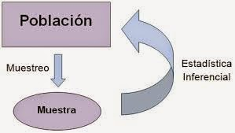

# Motivación

La motivación de este trabajo es *contribuir*, **desarrollar**, 

## Objetivos específicos

Los objetivos son:

  + Objetivo 1 es ...
    * salida 1
    * salida 2
    * salida 3
  + Objetivo 2 es ...
    - salida 1
    - salida 2
  + Objetivo 3 es ...
  
## Alcances  
  
  1. Alcance 1
  1. Alcance 2
  1. Alcance 3
  4. Alcance 4
  
## Metodología

Se plantea un modelo del tipo:

$$y_i= \beta_0+\beta_1x_i+\epsilon_i $$
El modelo $y_i= \beta_0+\beta_1x_i+\epsilon_i$

$$F(t)=\int_0^t f(x)dx$$

| Casos  | Método      | Población | Periodo |
|--------|-------------|-----------|---------|
| Caso 1 | muestra     | aves      | 2018    |
| Caso 2 | experimento | hormigas  | 2013    |




# Resultados

Los entornos para introducir código R se llaman Chunks


```{r,echo=FALSE}
x<-rnorm(1000)
summary(x)
```

Acá vemos un gráfico

```{r,eval=F}
plot(density(x))
```


```{r,echo=F,eval=T,message=F,warning=F}
y<-rbinom(1000,10,0.3)
t1<-table(y)
t1
barplot(t1)
```

A partir del resultado del estudio se tiene `r 4+9`, también el vector de datos `r 1:100`. La dimensión de $Y$ es `r length(y)`.


```{r}
library(knitr)
t1<-table(y,y)
t1
kable(t1)#tabla

library(DT)# dataframe
datatable(cars)
```
